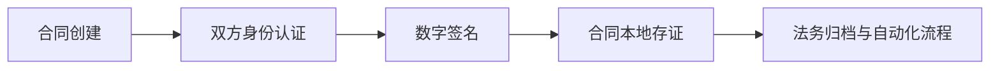

# stanfai-司单服Ai智能安全法务

> 版权归广西港妙科技有限公司所有

## 目录
1. [系统架构](#系统架构)
2. [功能大全](#功能大全)
3. [安全特性](#安全特性)
4. [电子签约流程](#电子签约流程)
5. [快速部署](#快速部署)
6. [API文档](#API文档)
7. [技术文档与模块说明](#技术文档与模块说明)
8. [未来改进计划](#未来改进计划)
9. [文件结构与内容分析](#文件结构与内容分析)

---

## 系统架构
### 核心组件
- **威胁检测引擎**：实时分析网络攻击模式
- **电子签约与法务模块**：本地自研电子合同、签名、存证、法务流程
- **三维可视化**：基于Three.js的攻击路径展示
- **WebSocket实时通信**：高效推送监控与安全数据
- **量子安全加密**：支持Kyber1024/NTRU/SABER等算法
- **多因素认证**：TOTP与生物识别
- **安全审计与日志**：全链路操作与异常记录

---

## 功能大全

| 功能模块         | 主要功能点                                                         | 说明/特色                         |
|------------------|--------------------------------------------------------------------|------------------------------------|
| 用户认证         | 密码登录、2FA、设备指纹、地理位置、记住我、会话安全                | 支持多因素与异常检测               |
| 权限管理         | RBAC角色、细粒度权限、管理员紧急入口                               | 支持动态权限分配                   |
| 威胁检测         | IDS、WAF、DDoS防护、AI行为分析、全球威胁情报                       | AI驱动与规则引擎结合               |
| 数据保护         | AES-256/量子加密、端到端加密、数据完整性校验                       | 支持密钥轮换与健康检查             |
| 电子签约与法务   | 合同模板、签名流程、本地存证、合同归档、法务流程自动化             | 全自研、独立创新，数据不出本地     |
| 实时监控         | 系统指标采集、WebSocket推送、历史趋势、图表可视化                  | 支持压缩与签名安全推送             |
| 审计与日志       | 操作日志、安全事件、API调用、管理员操作、异常告警                   | 支持多级日志与邮件通知             |
| API接口          | RESTful接口、签名校验、速率限制、标准响应格式                      | 支持自定义扩展                     |
| 管理后台         | 仪表盘、用户管理、模型设置、数据分析、历史监控、API管理             | 响应式UI，支持多端访问             |
| 系统自愈         | 数据库修复、表结构自检、版本回滚、健康检查                         | 支持一键修复与自动诊断             |

---

## 安全特性

### 基础防御能力
- **网络层防护**
  - Web应用防火墙(WAF)
  - DDoS防护
  - 入侵检测系统(IDS)
- **应用层防护**
  - 行为异常检测
  - 实时威胁情报
  - 安全漏洞扫描
- **数据保护**
  - AES-256端到端加密
  - 数据完整性验证
  - 安全数据存储

### 创新安全功能
- **量子安全体系**
  - 抗量子加密算法(Kyber1024/NTRU/SABER)
  - 动态密钥轮换
  - 量子安全通信协议
- **智能动态防御**
  - AI驱动的攻击面管理
  - 预测性安全运维
  - 自适应认证系统

---

## 电子签约流程


---

## 快速部署
```bash
# 安装依赖
npm install
composer install

# 启动服务
php -S localhost:8080
node threat-feed-server.js
```

---

## API文档
- 威胁数据接口：`/api/threats`
- 电子签约接口：`/api/contracts`
- 用户认证接口：`/api/login` `/api/logout`
- 实时监控接口：`/api/metrics`
- 更多接口详见 [API接口文档](/docs/api.md)

---

## 技术文档与模块说明

- [技术架构与实现细节](/docs/all.md)
- [API接口文档](/docs/api.md)
- [安全部署指南](/docs/security_deployment_guide.md)
- [量子加密指南](/docs/quantum_encryption_guide.md)
- [创新功能白皮书](/docs/innovation_whitepaper.md)
- [程序模块结构与说明](/docs/module_structure.md)
- [文件结构与内容分析](/docs/file_structure.md)

---

## 未来改进计划

- 支持更多量子加密算法与国密算法
- 增强AI威胁检测模型与自学习能力
- 引入微服务架构与容器化部署
- 支持多租户与分布式集群
- 增加移动端与小程序支持
- 优化前端三维可视化与交互体验
- 丰富API接口与第三方集成能力
- 自动化测试与CI/CD集成
- 法务流程智能化与本地知识库增强

---

## 文件结构与内容分析

- `config.php`：主配置文件，环境变量优先，安全与数据库配置详尽
- `libs/`：核心库，包括加密、数据库、安全、会话等
- `controllers/`：业务控制器，分模块管理
- `services/`：服务层，封装业务逻辑与外部集成
- `middlewares/`：中间件，负责认证、速率限制、安全等
- `admin/`：后台管理相关页面与服务
- `js/`、`css/`、`styles/`：前端资源与可视化
- `ai_companion_db.sql`：数据库初始化脚本
- `README.md`、`docs/`：文档与开发说明

详细内容与各文件说明请参考 [文件结构与内容分析文档](/docs/file_structure.md)。

---

## 架构图

> 本系统所有功能、模块、代码均为广西港妙科技有限公司自主研发，严禁抄袭仿冒。

