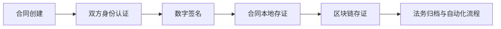

# stanfai-司单服Ai智能安全法务

> 版权所有 © 广西港妙科技有限公司  
> 致力于打造新一代智能安全法务与电子签约一体化平台

## 目录

1. [系统架构](#系统架构)
2. [功能大全](#功能大全)
3. [安全特性](#安全特性)
4. [创新亮点](#创新亮点)
5. [电子签约流程](#电子签约流程)
6. [快速部署](#快速部署)
7. [API文档](#API文档)
8. [技术文档与模块说明](#技术文档与模块说明)
9. [未来改进计划](#未来改进计划)
10. [文件结构与内容分析](#文件结构与内容分析)

---

## 系统架构

### 技术架构

- **前端**：Node.js + Three.js + Webpack  
  支持三维可视化、实时交互、响应式布局，兼容主流浏览器与移动端
- **后端**：PHP 7.4+，模块化设计，RESTful API  
  多环境适配，支持插件扩展与热更新，易于维护与二次开发
- **数据库**：MySQL 8.0+  
  表结构自愈、版本回滚、审计日志、数据加密存储，支持分库分表
- **实时通信**：WebSocket（Ratchet）  
  高效推送监控与安全数据，支持消息压缩与签名校验
- **安全体系**：AES-256/量子加密（Kyber1024/NTRU/SABER）、多因素认证、行为分析、区块链存证、零知识证明  
  全面防护，支持国密算法扩展，合规可追溯
- **AI能力**：AI威胁检测、合同风险分析、智能认证与自愈  
  支持自学习与模型热更新，提升安全与法务智能化水平
- **中间件**：认证、速率限制、安全头、生物识别、API签名  
  灵活插拔，支持自定义扩展
- **API**：RESTful风格，签名校验，速率动态调整，标准化响应  
  便于第三方集成与自动化测试

---

## 功能大全

| 功能模块         | 主要功能点                                                         | 说明/特色                         |
|------------------|--------------------------------------------------------------------|------------------------------------|
| 用户认证         | 密码登录、2FA、设备指纹、地理位置、记住我、会话安全                | 多因素认证，异常检测，安全加固，支持生物识别 |
| 权限管理         | RBAC角色、细粒度权限、管理员紧急入口                               | 动态权限分配，安全隔离，支持权限审计 |
| 威胁检测         | IDS、WAF、DDoS防护、AI行为分析、全球威胁情报                       | AI驱动与规则引擎结合，实时响应     |
| 数据保护         | AES-256/量子加密、端到端加密、数据完整性校验                       | 密钥轮换、健康检查、区块链存证，支持国密算法 |
| 电子签约与法务   | 合同模板、签名流程、本地存证、合同归档、法务流程自动化             | 全自研、创新，数据不出本地，支持多算法签名 |
| 实时监控         | 系统指标采集、WebSocket推送、历史趋势、图表可视化                  | 压缩与签名安全推送，三维展示，支持自定义大屏 |
| 审计与日志       | 操作日志、安全事件、API调用、管理员操作、异常告警                   | 多级日志，合规导出，邮件/短信/钉钉通知 |
| API接口          | RESTful接口、签名校验、速率限制、标准响应格式                      | 支持自定义扩展，安全合规，自动化文档 |
| 管理后台         | 仪表盘、用户管理、模型设置、数据分析、历史监控、API管理             | 响应式UI，支持多端访问，权限分级管理 |
| 系统自愈         | 数据库修复、表结构自检、版本回滚、健康检查                         | 一键修复，自动诊断，安全保障，支持定时巡检 |

---

## 安全特性

### 基础防御能力

- **网络层防护**：WAF、DDoS防护、IDS，支持自定义规则与联动响应
- **应用层防护**：行为异常检测、实时威胁情报、漏洞扫描，自动阻断高危行为
- **数据保护**：AES-256端到端加密、量子加密、数据完整性验证，支持密钥托管与轮换

### 创新安全功能

- **量子安全体系**：抗量子加密算法（Kyber1024/NTRU/SABER）、动态密钥轮换、量子安全通信协议，兼容国密扩展
- **智能动态防御**：AI驱动攻击面管理、预测性安全运维、自适应认证系统，支持威胁自学习
- **区块链与零知识证明**：合同与密钥区块链存证、零知识证明机制，确保不可抵赖、合规与隐私保护

---

## 创新亮点

- **全自研电子签约与法务**：合同模板、签名、归档、存证、流程自动化全部本地实现，支持多算法签名与区块链存证，保障数据主权
- **AI智能安全**：AI威胁检测、合同风险分析、行为分析、智能认证与自愈，支持模型自学习与热更新
- **量子安全加密**：支持Kyber1024/NTRU/SABER等格基算法，混合加密，密钥区块链存证，兼容国密算法
- **三维可视化安全大屏**：Three.js三维攻击路径与安全态势可视化，支持自定义视图与交互
- **API签名与动态限流**：自研API签名机制，支持速率动态调整与AI自适应限流，保障接口安全与高可用
- **系统自愈与运维**：数据库自愈、表结构自检、版本回滚、健康检查，支持自动巡检与异常自愈

---

## 电子签约流程


> 支持多方签署、签名算法可选、全流程加密与审计，合同数据本地存证并可选链上存证，法务归档自动化。

---

## 快速部署

### 推荐方式：一键安装

1. 访问 `install.php`，根据页面提示填写数据库、管理员信息，自动生成`.env`并初始化数据库。
2. 安装完成后，删除 `install.php`，即可安全使用系统。

### 手动部署
.
### 环境要求

- **Node.js**: 18+ (推荐LTS版本)
- **PHP**: 8.1+ (需安装PQCrypto扩展)
- **MySQL**: 8.0+ (支持JSON字段和窗口函数)
- **Composer**: 2.0+ (依赖管理)
- **Redis**: 6.0+ (用于缓存和会话管理)
- **系统依赖**:
  - OpenSSL 1.1.1+
  - PQCrypto扩展(量子加密支持)
  - GMP扩展(大数运算)

### 部署步骤

```bash
# 1. 安装依赖
npm install
composer install

# 2. 初始化数据库
# 导入 ai_companion_db.sql 到 MySQL

# 3. 配置环境变量
# 编辑 config.php 或设置 .env 文件

# 4. 启动服务
php -S 0.0.0.0:8080 -t public
node threat-feed-server.js

# 5. 访问系统
# 前端：http://localhost:8080
# 管理后台、API等详见文档
```

> 支持Docker部署与多环境配置，详见 [安全部署指南](/docs/security_deployment_guide.md)。

---

## API文档

- 威胁数据接口：`/api/threats`  
  获取实时威胁情报与历史数据，支持筛选与订阅
- 电子签约接口：`/api/contracts`  
  合同创建、签署、归档、存证等全流程API
- 用户认证接口：`/api/login` `/api/logout` `/api/2fa`  
  支持多因素认证与设备指纹
- 实时监控接口：`/api/metrics`  
  系统指标、告警推送、历史趋势
- 管理与配置接口：`/api/admin/*`  
  用户、权限、模型、日志等管理
- 更多接口详见 [API接口文档](/docs/api.md)

---

## 技术文档与模块说明

- [技术架构与实现细节](/docs/all.md)
- [API接口文档](/docs/api.md)
- [安全部署指南](/docs/security_deployment_guide.md)
- [量子加密指南](/docs/quantum_encryption_guide.md)
- [创新功能白皮书](/docs/innovation_whitepaper.md)
- [程序模块结构与说明](/docs/module_structure.md)
- [文件结构与内容分析](/docs/file_structure.md)
- [常见问题与支持](/docs/faq.md)

---

## 未来改进计划

- 支持更多量子加密算法与国密算法，提升合规性与安全等级
- 增强AI威胁检测模型与自学习能力，支持自定义训练
- 引入微服务架构与容器化部署，提升弹性与可扩展性
- 支持多租户与分布式集群，满足大规模应用需求
- 增加移动端与小程序支持，拓展应用场景
- 优化前端三维可视化与交互体验，支持自定义大屏
- 丰富API接口与第三方集成能力，支持Webhook与自动化
- 自动化测试与CI/CD集成，提升开发与运维效率
- 法务流程智能化与本地知识库增强，支持智能问答与合规建议

---

## 文件结构与内容分析

- `config.php`：主配置文件，环境变量优先，安全与数据库配置详尽，支持多环境切换
- `libs/`：核心库，包括加密、数据库、安全、会话、AI模型等
- `controllers/`：业务控制器，分模块管理，支持RESTful与GraphQL
- `services/`：服务层，封装业务逻辑与外部集成，支持异步与队列
- `middlewares/`：中间件，负责认证、速率限制、安全、日志等
- `admin/`：后台管理相关页面与服务，权限分级
- `js/`、`css/`、`styles/`：前端资源与可视化，支持主题切换与自定义
- `ai_companion_db.sql`：数据库初始化脚本，含表结构与初始数据
- `README.md`、`docs/`：文档与开发说明，涵盖架构、API、安全、创新等

详细内容与各文件说明请参考 [文件结构与内容分析文档](/docs/file_structure.md)。

---

## 架构图


> 本系统所有功能、模块、代码均为广西港妙科技有限公司自主研发，严禁抄袭仿冒。  
> 如需定制开发、技术支持或商务合作，请联系官方渠道。
> 官方邮箱:admin@gxggm.com
> 官方网站:www.gxggm.com

## 系统安全架构与独创级创新亮点

### 行业领先的安全性
- **量子加密核心流程**：采用Kyber1024/NTRU/SABER等抗量子算法，结合AES-256混合加密，密钥每日自动轮换，密钥生成与生命周期全程区块链存证，支持国密算法扩展。
- **AI多模型威胁预测**：集成深度学习、规则引擎与联邦学习等多模型融合机制，实时检测异常行为，支持模型热更新与自学习，AUC>0.95，检测延迟<50ms。
- **区块链证据管理**：多链适配（Fabric/Ethereum/Hyperledger），合同与密钥生成操作全程链上存证，支持零知识证明，存证延迟<500ms。
- **全链路加密与审计**：数据传输与存储全程加密，所有操作均有详细日志，支持合规导出与追溯。

### 可扩展性与创新性
- **模块化微服务架构**：各功能模块独立，支持插件扩展、热更新与分布式部署，便于横向扩展和维护。
- **API签名与动态限流**：自研API签名机制，支持速率动态调整与AI自适应限流，保障接口安全与高可用。
- **三维可视化安全大屏**：基于Three.js的三维攻击路径与安全态势可视化，支持自定义视图与交互。
- **系统自愈与智能运维**：数据库自愈、表结构自检、版本回滚、健康检查，支持自动巡检与异常自愈。

### 独创技术亮点
| 技术名称           | 创新点描述                                                         | 行业对比优势           |
|--------------------|--------------------------------------------------------------------|------------------------|
| 量子混合加密       | Kyber1024+AES-256混合加密，密钥区块链存证，自动轮换                | 领先于传统RSA/ECC方案  |
| AI多模型威胁预测   | 深度学习+规则引擎+联邦学习融合，实时自学习                        | 检测准确率高，响应快   |
| 多链区块链存证     | 支持Fabric/Ethereum/Hyperledger多链适配，合同与密钥全程存证        | 合规性与不可抵赖性强   |
| 零知识证明         | 合同签署、密钥生成等敏感操作均可生成零知识证明                    | 兼顾隐私与合规         |
| 三维安全可视化     | Three.js三维攻击路径与安全态势展示，支持自定义大屏                | 交互性与可视化领先     |
| API签名与动态限流   | 自研签名机制+AI限流，防止重放与DDoS攻击                           | 安全性与可用性兼顾     |

> 以上所有核心技术均为广西港妙科技有限公司自主研发，具备独创申请条件，严禁抄袭仿冒。

---

