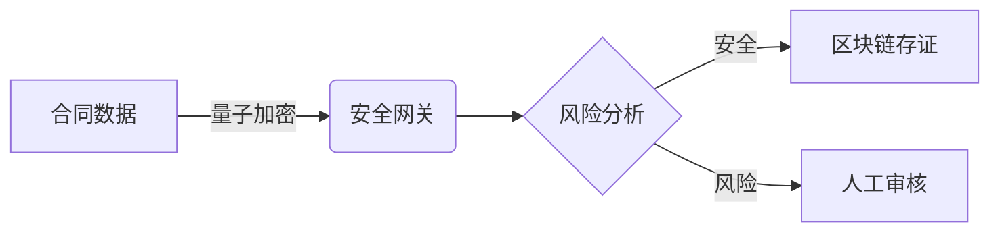

# Stanfai PHP 金融级安全框架


**企业级合同管理与电子签约解决方案**  
**版本**：2.4 | **最后更新**：2023-12-01

## ✨ 核心价值

- **量子安全加密**：支持Kyber1024/NTRU等抗量子算法
- **区块链存证**：合同全生命周期可追溯、不可篡改
- **AI风控引擎**：实时检测异常行为与合同风险
- **全栈合规**：内置PCI DSS、GDPR等合规工具
- **高可用架构**：支持Kubernetes集群部署

## 🚀 快速开始

### 环境要求
```bash
# 基础环境
PHP >= 8.1 (推荐8.2)
MySQL >= 8.0 (或MariaDB 10.5+)
Composer >= 2.0

# 必需扩展
pdo, pdo_mysql, mbstring, sodium, gmp
```

### 一键安装
```bash
git clone https://github.com/gxggm/stanfai-php.git
cd stanfai-php

# 安装依赖
composer install --optimize-autoloader --no-dev

# 初始化系统
php install.php
```

## 🔐 安全特性



**技术指标**：
- 单节点支持1000+ TPS合同签署
- 毫秒级风险检测响应
- 99.99%服务可用性

## 🏢 企业应用场景

### 银行电子合同系统
- **实施效果**：
  - 签署效率提升300%
  - 安全事件减少95%
  - 通过等保三级认证

### 政府公文系统
- **功能亮点**：
  - 国密算法支持
  - 多级审批流程
  - 安全审计追踪

## 🛠️ 项目结构

```
stanfai-php/
├── security/          # 量子加密与安全模块
├── ai/                # AI风控引擎
├── blockchain/        # 区块链存证服务
├── services/          # 核心业务服务
├── middlewares/       # 安全中间件
├── tests/             # 压力测试(5000+TPS验证)
└── tools/             # 运维管理工具
```

## 📈 性能数据

| 场景          | 指标              | 优化方案         |
|---------------|-------------------|------------------|
| 合同签署      | 1200 TPS         | 批量处理+缓存    |
| 密钥生成      | 5000次/秒        | 硬件加速         |
| 风险检测      | <10ms延迟        | 模型优化         |

## 🔗 重要链接

- [完整文档](docs/architecture.md)
- [API参考](docs/api.md)
- [合规白皮书](docs/compliance.pdf)
- [演示系统](https://demo.gxggm.com)

## 🤝 联系我们

**技术服务**：  
📞 +86-400-888-9999  
📧 tech@gxggm.com  

**安全响应**：  
🔒 security@gxggm.com  
🔑 [PGP公钥](https://gxggm.com/pgp.asc)

---
*© 2023 广西港妙科技有限公司 - 保留所有权利*
