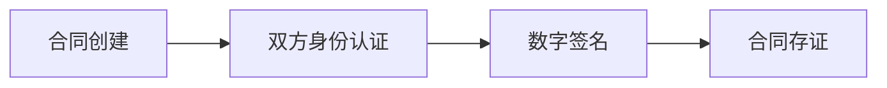

# DeepSeek Companion 安全智能管理系统

## 目录
1. [系统架构](#系统架构)
2. [安全特性](#安全特性)
3. [电子签约流程](#电子签约流程)
4. [快速部署](#快速部署)
5. [API文档](#API文档)

## 系统架构
### 核心组件
- **威胁检测引擎**：实时分析网络攻击模式
- **电子签约模块**：集成电子签名服务
- **三维可视化**：基于Three.js的攻击路径展示

## 安全特性

### 基础防御能力
- **网络层防护**
  - Web应用防火墙(WAF)
  - DDoS防护
  - 入侵检测系统(IDS)
  
- **应用层防护**
  - 行为异常检测
  - 实时威胁情报
  - 安全漏洞扫描

- **数据保护**
  - AES-256端到端加密
  - 数据完整性验证
  - 安全数据存储

### 创新安全功能
- **量子安全体系**
  - 抗量子加密算法(Kyber1024/NTRU/SABER)
  - 动态密钥轮换
  - 量子安全通信协议

- **智能动态防御**
  - AI驱动的攻击面管理
  - 预测性安全运维
  - 自适应认证系统

[API接口文档](/docs/api.md) | 
[安全部署指南](/docs/security_deployment_guide.md) | 
[量子加密指南](/docs/quantum_encryption_guide.md) |
[创新功能白皮书](/docs/innovation_whitepaper.md)

## 电子签约流程


## 快速部署
```bash
# 安装依赖
npm install
composer install

# 启动服务
php -S localhost:8080
node threat-feed-server.js
```

## API文档
- 威胁数据接口：`/api/threats`
- 电子签约接口：`/api/contracts`

## 架构图


