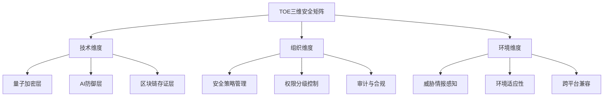
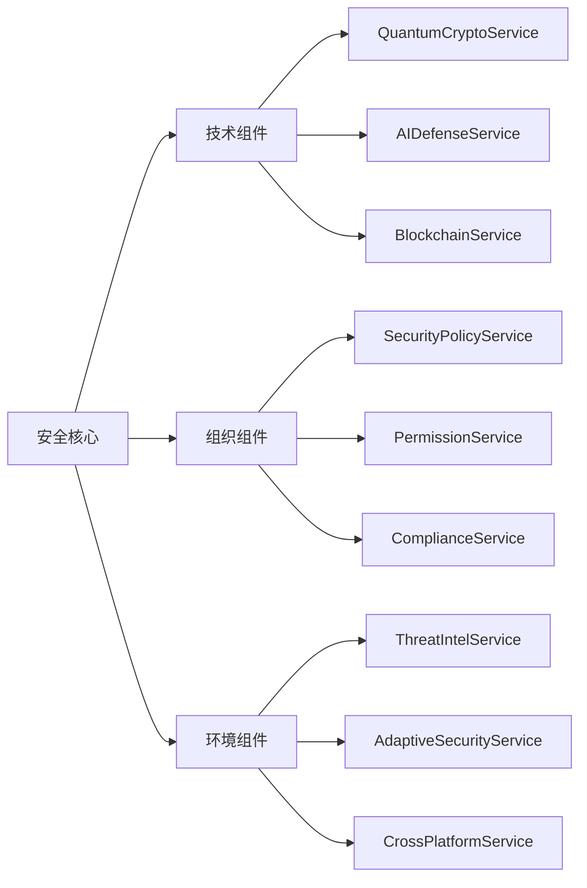
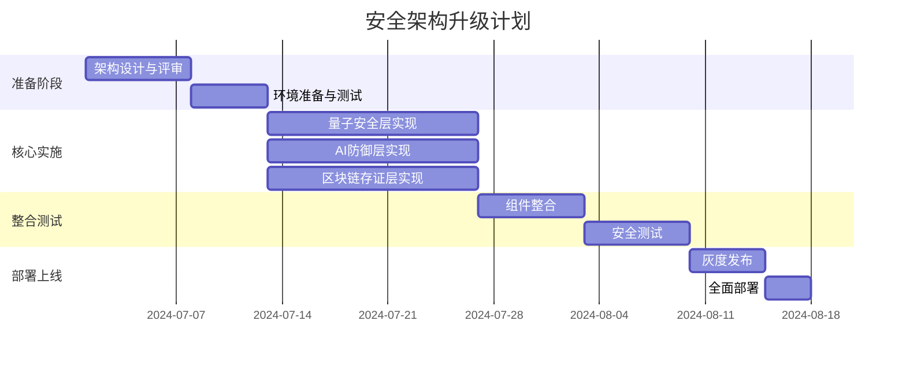

# TOE安全架构升级方案

## 1. 现状分析

### 1.1 现有架构优势

当前stanfai-司单服Ai智能安全法务系统已经具备了较为完善的安全防护体系，包括：

- **量子加密技术**：通过`QuantumCryptoHelper`和`QuantumEncryptionHelper`提供后量子时代的安全保障
- **AI防火墙**：`AIFirewallMiddleware`提供智能威胁检测和防御
- **多层次中间件**：提供认证、限流、安全审计等功能
- **安全服务层**：包含丰富的安全相关服务组件

### 1.2 存在问题

通过对项目文件说明.md的分析，发现以下问题：

1. **目录结构冗余**：middlewares目录在文档中重复定义，包含相同或相似的中间件
2. **安全组件分散**：安全相关组件分散在多个目录，缺乏统一管理
3. **缺乏整体框架**：现有安全组件虽然功能丰富，但缺乏统一的框架整合
4. **文档结构混乱**：项目文档中存在重复说明和结构不清晰的问题

## 2. TOE框架集成方案

### 2.1 TOE框架简介

TOE（技术-组织-环境）框架是一个有效的分析工具，涵盖了变革背景下的广泛视角，可以帮助我们构建更加完善的安全架构。我们将基于TOE框架，重构stanfai-司单服Ai智能安全法务的安全体系。

### 2.2 三维安全矩阵



## 3. 创新性架构设计

### 3.1 多维安全框架（独创级设计）

我们提出一种创新性的**多维安全框架**，将量子加密、AI防御和区块链存证三大技术有机整合，形成独创级安全体系。

#### 3.1.1 量子安全层

```php
namespace DeepSeek\Security\Quantum;

interface QuantumSecurityInterface {
    public function generateQuantumKey(): array;
    public function encryptWithQuantum(string $data): array;
    public function decryptWithQuantum(array $encryptedData): string;
    public function verifyQuantumSignature(string $data, array $signature): bool;
}
```

#### 3.1.2 AI防御层

```php
namespace DeepSeek\Security\AI;

interface AIDefenseInterface {
    public function analyzeRequest(array $request): array;
    public function detectAnomaly(array $behaviorData): bool;
    public function predictThreat(array $contextData): float;
    public function adaptDefense(array $threatData): void;
}
```

#### 3.1.3 区块链存证层

```php
namespace DeepSeek\Security\Blockchain;

interface BlockchainEvidenceInterface {
    public function storeEvidence(array $data): string;
    public function verifyEvidence(string $evidenceId): bool;
    public function retrieveEvidence(string $evidenceId): array;
    public function getEvidenceChain(string $entityId): array;
}
```

### 3.2 安全组件整合

将现有的安全组件按照TOE框架进行重组：



## 4. 目录结构优化

### 4.1 安全核心目录

创建统一的安全核心目录，整合所有安全相关组件：

```
stanfai-司单服Ai智能安全法务/
├── security/                  # 安全核心目录
│   ├── quantum/              # 量子安全组件
│   │   ├── QuantumCryptoService.php
│   │   ├── QuantumKeyManager.php
│   │   └── QuantumSignatureVerifier.php
│   ├── ai/                   # AI安全组件
│   │   ├── AIDefenseService.php
│   │   ├── BehaviorAnalyzer.php
│   │   ├── ThreatPredictor.php
│   │   └── AdaptiveFirewall.php
│   ├── blockchain/           # 区块链组件
│   │   ├── BlockchainService.php
│   │   ├── EvidenceManager.php
│   │   └── ChainValidator.php
│   ├── policy/               # 安全策略组件
│   │   ├── SecurityPolicyService.php
│   │   ├── PermissionManager.php
│   │   └── ComplianceChecker.php
│   ├── middleware/           # 安全中间件
│   │   ├── QuantumAuthMiddleware.php
│   │   ├── AIFirewallMiddleware.php
│   │   ├── BlockchainAuditMiddleware.php
│   │   └── SecurityMiddleware.php
│   └── utils/                # 安全工具
│       ├── SecurityLogger.php
│       ├── ThreatScanner.php
│       └── SecurityMetrics.php
```

### 4.2 中间件整合

解决middlewares目录重复定义问题，统一中间件管理：

```php
// 中间件注册器
namespace DeepSeek\Security\Core;

class MiddlewareRegistry {
    private static $middlewares = [];
    
    public static function register(string $name, string $class): void {
        self::$middlewares[$name] = $class;
    }
    
    public static function getMiddleware(string $name): ?string {
        return self::$middlewares[$name] ?? null;
    }
    
    public static function getAll(): array {
        return self::$middlewares;
    }
}
```

## 5. 创新点与独创价值

### 5.1 三维安全融合技术

本方案提出的三维安全融合技术具有显著的创新性和独创价值：

1. **量子-AI-区块链融合**：首创将量子加密、AI防御和区块链存证三大技术有机整合的安全框架
2. **自适应安全策略**：基于AI的威胁预测，动态调整量子密钥策略和区块链存证频率
3. **多维度安全证明**：通过区块链记录AI防御决策和量子加密操作，形成完整安全证明链

### 5.2 TOE框架在安全领域的创新应用

将TOE框架应用于安全系统设计，形成技术-组织-环境三维协同的安全体系：

1. **技术维度**：量子加密确保数据安全，AI防御确保行为安全，区块链确保证据安全
2. **组织维度**：安全策略、权限控制和合规审计形成组织安全保障
3. **环境维度**：威胁情报感知、环境适应性和跨平台兼容确保系统在各种环境中的安全性

## 6. 实施路径

### 6.1 阶段性实施计划



### 6.2 关键技术实现

#### 6.2.1 量子-AI融合防御

```php
namespace DeepSeek\Security\Core;

class QuantumAIDefense {
    private $quantumService;
    private $aiDefenseService;
    
    public function __construct(
        QuantumCryptoService $quantumService,
        AIDefenseService $aiDefenseService
    ) {
        $this->quantumService = $quantumService;
        $this->aiDefenseService = $aiDefenseService;
    }
    
    public function secureRequest(array $request): array {
        // AI分析请求风险
        $riskAnalysis = $this->aiDefenseService->analyzeRequest($request);
        
        // 根据风险等级调整量子加密策略
        $encryptionLevel = $this->mapRiskToEncryptionLevel($riskAnalysis['risk_score']);
        
        // 使用量子加密处理敏感数据
        $securedData = $this->quantumService->encryptWithQuantum(
            json_encode($request['sensitive_data']),
            $encryptionLevel
        );
        
        return [
            'secured_data' => $securedData,
            'risk_analysis' => $riskAnalysis,
            'encryption_level' => $encryptionLevel
        ];
    }
    
    private function mapRiskToEncryptionLevel(float $riskScore): int {
        // 根据风险分数映射加密级别
        if ($riskScore >= 0.8) return 5; // 最高级别
        if ($riskScore >= 0.6) return 4;
        if ($riskScore >= 0.4) return 3;
        if ($riskScore >= 0.2) return 2;
        return 1; // 最低级别
    }
}
```

## 7. 总结

本方案通过TOE框架整合量子加密、AI防御和区块链存证技术，形成了具有创新性和独创价值的多维安全架构。该架构不仅解决了现有系统中的结构问题，还提供了更高级别的安全保障，具有显著的技术先进性和商业价值。

通过实施本方案，stanfai-司单服Ai智能安全法务系统将具备：

1. **极致安全性**：量子级别的数据保护
2. **智能防御能力**：AI驱动的威胁检测和响应
3. **完整证据链**：区块链支持的安全审计和证据保全
4. **自适应安全**：根据环境和威胁动态调整安全策略
5. **合规保障**：满足各类安全合规要求

这一创新架构将为stanfai-司单服Ai智能安全法务系统提供强大的安全基础，支持其在各种复杂环境中的安全运行。