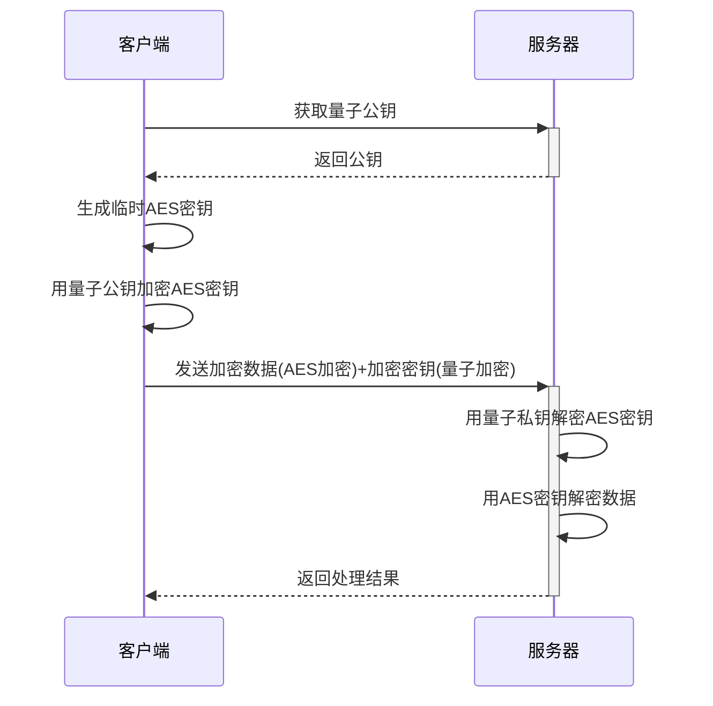

## DeepSeek集成API文档

### 1. 集成概述
DeepSeek AI安全引擎通过REST API和量子加密技术集成到系统中，提供以下核心功能：
- 实时威胁分析
- 异常行为检测
- 安全事件预测
- 量子级数据保护(基于Kyber1024算法)

### 2. 接口规范

#### 2.1 基础信息
- **接口地址**：`/api/deepseek-integration`
- **认证方式**：API Key + JWT双重认证
- **请求方法**：POST
- **Content-Type**：application/json

#### 2.2 请求参数
| 参数名 | 类型 | 必填 | 描述 |
|--------|------|------|------|
| api_key | string | 是 | DeepSeek平台分配的API密钥 |
| jwt_token | string | 是 | 系统生成的JWT令牌 |
| quantum_sig | string | 否 | 量子签名(启用量子加密时必填) |
| data | object | 是 | 威胁数据对象 |
| data.type | string | 是 | 数据类型：threat/behavior/anomaly/quantum |
| data.payload | object | 是 | 实际数据内容 |
| data.encryption | string | 否 | 加密类型：aes/quantum(默认aes) |
| timestamp | number | 否 | 事件时间戳(毫秒) |

#### 2.3 响应格式
成功响应(200)：
```json
{
  "status": "success",
  "data": {
    "threat_level": "high|medium|low",
    "recommendations": [],
    "analysis_id": "string",
    "encryption": "aes|quantum",
    "quantum_key_id": "string" // 量子密钥ID(如果使用量子加密)
  }
}
```

错误响应(4xx/5xx)：
```json
{
  "status": "error",
  "code": "error_code",
  "message": "错误描述",
  "quantum_available": boolean // 是否支持量子加密
}
```

### 3. 错误代码
| 代码 | 描述 | 解决方案 |
|------|------|----------|
| 4001 | 无效API密钥 | 检查API密钥配置 |
| 4002 | JWT验证失败 | 重新生成JWT令牌 |
| 4003 | 量子签名无效 | 检查量子密钥状态 |
| 5001 | 数据分析超时 | 重试或减少数据量 |
| 5002 | 量子加密不可用 | 检查pqcrypto扩展 |

### 4. 最佳实践

#### 4.1 Node.js集成示例(传统+量子)
```javascript
const { DeepSeekClient } = require('@deepseek/sdk');
const jwt = require('jsonwebtoken');
const { CryptoHelper } = require('./libs/CryptoHelper');

// 初始化量子加密
CryptoHelper.initPQC();

const client = new DeepSeekClient({
  apiKey: process.env.DEEPSEEK_API_KEY,
  quantumPublicKey: CryptoHelper.getQuantumPublicKey(),
  timeout: 5000
});

async function analyzeThreat(data, useQuantum = false) {
  const token = jwt.sign({ scope: 'threat' }, process.env.JWT_SECRET);
  
  try {
    const payload = {
      jwt_token: token,
      data: {
        ...data,
        encryption: useQuantum ? 'quantum' : 'aes'
      }
    };

    // 添加量子签名
    if (useQuantum) {
      payload.quantum_sig = CryptoHelper.getQuantumSignature(JSON.stringify(data));
    }

    const response = await client.analyze(payload);
    return response.data;
  } catch (error) {
    console.error('分析失败:', error.response?.data || error.message);
    throw error;
  }
}

// 量子加密数据传输示例
async function sendQuantumData(data) {
  const encrypted = CryptoHelper.quantumEncrypt(JSON.stringify(data));
  return analyzeThreat({ 
    type: 'quantum', 
    payload: encrypted 
  }, true);
}
```

### 5. 量子加密专项

#### 5.1 启用要求
- 安装pqcrypto扩展
- 服务器支持Kyber1024算法
- 客户端存储量子公钥

#### 5.2 混合加密流程


#### 5.3 密钥轮换策略
1. 每日自动轮换量子密钥对
2. 密钥有效期最长7天
3. 支持多密钥并行解密

#### 4.2 性能优化建议
1. 批量处理数据，减少API调用次数
2. 实现本地缓存，对重复数据直接返回缓存结果
3. 使用WebSocket连接实现实时分析

## 5. 合同管理API

### 5.1 合同模板管理
- `GET /api/contract-templates` - 获取合同模板列表
  - 响应:
    ```json
    [
      {
        "id": "模板ID",
        "name": "模板名称",
        "created_at": "创建时间",
        "created_by": "创建人ID"
      }
    ]
    ```

### 5.2 合同管理
- `GET /api/contracts` - 获取合同列表
  - 参数:
    - `status` - 合同状态(draft/pending/signed/archived)
    - `q` - 搜索关键词
  - 响应:
    ```json
    [
      {
        "id": "合同ID",
        "name": "合同名称",
        "status": "合同状态",
        "created_at": "创建时间",
        "signed_at": "签署时间",
        "parties": ["参与方信息"]
      }
    ]
    ```

- `POST /api/contracts` - 创建新合同
  - 请求体:
    ```json
    {
      "name": "合同名称",
      "template_id": "模板ID",
      "content": "合同内容",
      "parties": [
        {
          "name": "参与方名称",
          "email": "参与方邮箱"
        }
      ]
    }
    ```

- `GET /api/contracts/{id}` - 获取合同详情
  - 响应:
    ```json
    {
      "id": "合同ID",
      "name": "合同名称",
      "content": "合同内容",
      "status": "合同状态",
      "signatures": [
        {
          "user_id": "签署人ID",
          "method": "签署方式",
          "signed_at": "签署时间"
        }
      ],
      "risk_analysis": {
        "level": "风险等级",
        "details": "风险详情"
      }
    }
    ```

### 5.3 合同签署与归档
- `POST /api/contracts/{id}/sign` - 签署合同
  - 请求体:
    ```json
    {
      "signature": "签名数据",
      "algorithm": "签名算法(RSA-SHA512/BIOMETRIC)"
    }
    ```

- `POST /api/contracts/{id}/archive` - 归档合同
  - 响应:
    ```json
    {
      "success": true,
      "archive_id": "归档ID",
      "blockchain_proof": "区块链存证哈希"
    }
    ```

### 5.4 合同风险分析
- `GET /api/contracts/{id}/risk-analysis` - 获取合同风险分析
  - 响应:
    ```json
    {
      "risk_level": "high|medium|low",
      "risky_clauses": [
        {
          "clause": "条款内容",
          "risk_type": "风险类型",
          "suggestion": "修改建议"
        }
      ]
    }
    ```
