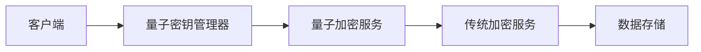
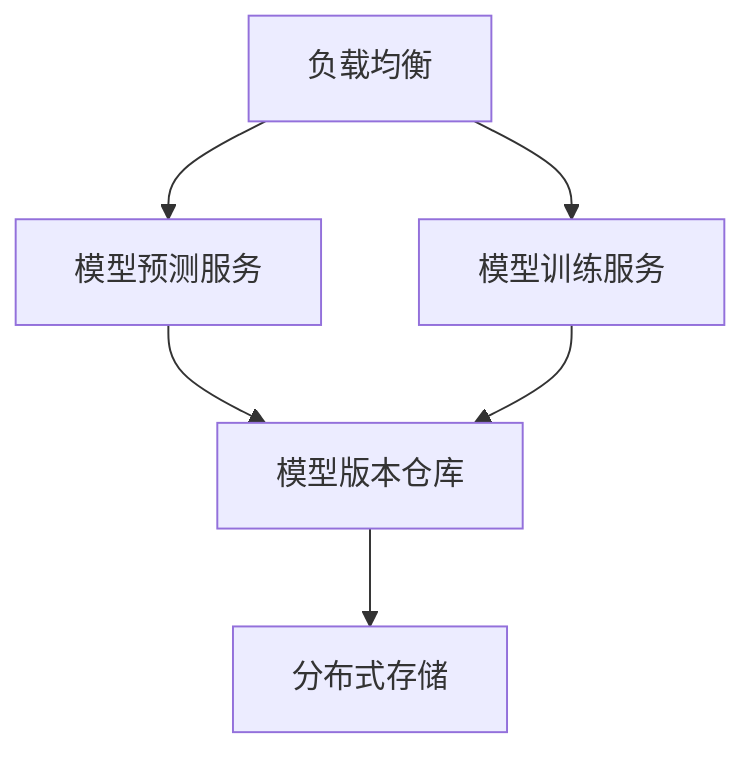
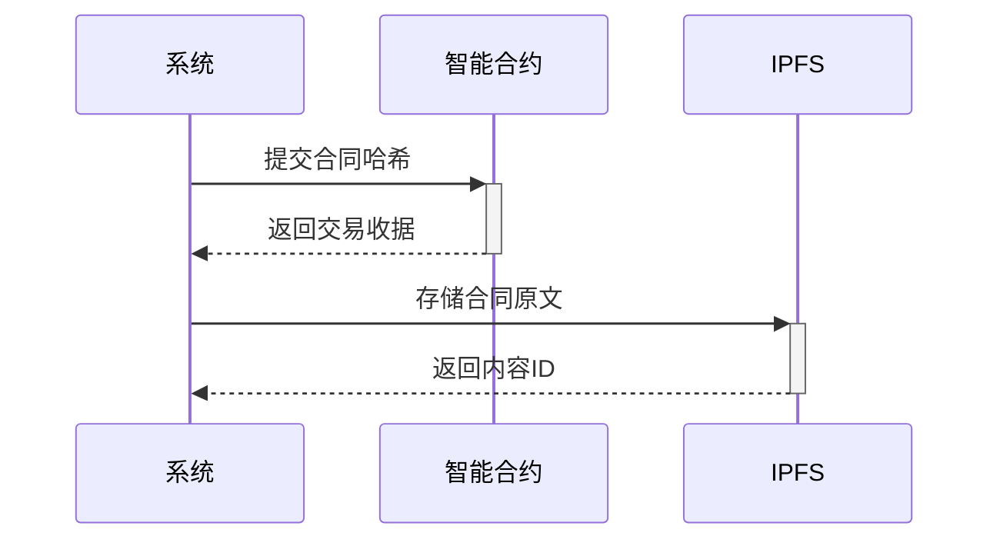

# 系统架构设计

## 1. 总体架构图

## 2. 技术栈
- **前端**: Bootstrap 5 + Chart.js
- **后端**: PHP 8.1
- **数据库**: MySQL 8.0
- **缓存**: Redis
- **安全**: OpenSSL加密

## 3. 分层架构

### 3.1 表现层
- 基于Bootstrap的响应式UI
- 管理后台界面
- 数据可视化组件

### 3.2 应用层
- 控制器(Controllers)
- 中间件(Middlewares)
- 路由系统
- **DeepSeek集成控制器**：处理AI分析请求和响应

### 3.3 服务层
- 加密服务(CryptoHelper)
- 认证服务(AuthService)
- 数据统计服务
- **DeepSeek分析服务**：
  - 威胁数据预处理
  - API调用封装
  - 结果缓存管理
  - 错误处理和重试机制

### 3.4 数据访问层
- 数据库访问(DatabaseHelper)
- 缓存管理
- 数据模型
- **DeepSeek数据适配器**：格式化数据供AI分析

## 4. 关键流程

### 4.3 DeepSeek集成流程

## 5. 量子加密架构

### 5.1 组件图

### 5.2 核心组件
- **量子密钥管理器**：负责密钥生成、轮换和分发
- **混合加密引擎**：结合AES和量子加密算法
- **密钥存储库**：安全存储量子密钥对

### 5.3 加密流程
1. 客户端获取量子公钥
2. 生成临时AES会话密钥
3. 用量子公钥加密AES密钥
4. 用AES密钥加密数据
5. 组合传输加密数据和密钥

## 6. AI服务架构

### 6.1 服务拓扑

### 6.2 核心特性
- **多模型支持**：同时部署多个模型版本
- **A/B测试**：流量分流比较模型效果
- **自动扩展**：根据负载动态调整实例

## 7. 合同管理架构

### 7.1 区块链集成

## 4. 关键流程

### 4.1 用户认证流程

### 4.2 数据加密流程
1. 初始化加密参数
2. 数据序列化
3. AES-256-CBC加密
4. 自定义编码
5. 存储/传输
