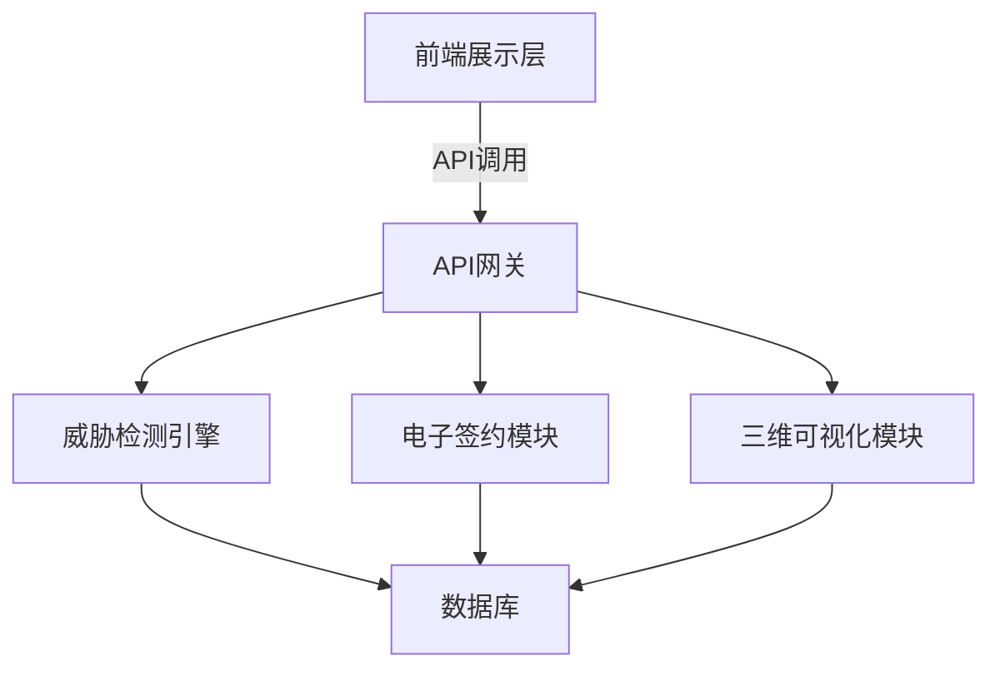
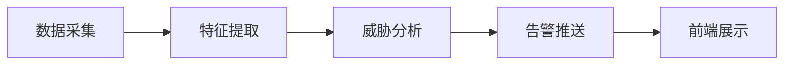
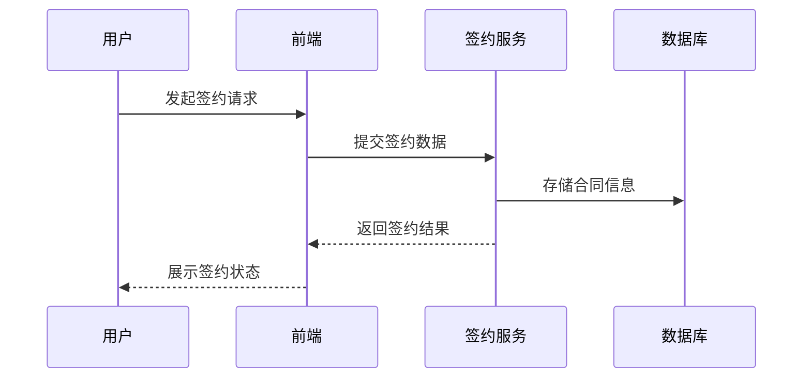
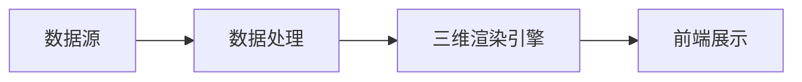

# 架构图

这里将详细介绍系统的架构图，从整体架构到模块细节逐步展开。

## 整体架构

系统整体架构如下图所示，采用分层设计，主要包括前端展示层、业务逻辑层和数据存储层，各模块通过 API 网关进行通信。

- **前端展示层**：为用户提供交互界面，包括威胁检测、电子签约和三维可视化等功能入口。
- **API网关**：统一接收前端请求，路由到对应后端服务，负责安全认证与流量控制。
- **威胁检测引擎**：负责安全威胁分析与告警。
- **电子签约模块**：实现合同签署、存证等功能。
- **三维可视化模块**：提供三维数据展示与交互。
- **数据库**：统一存储业务数据和日志。

## 模块细节

### 威胁检测引擎

威胁检测引擎架构如下：

- **数据采集**：实时采集网络流量、日志等原始数据。
- **特征提取**：对采集数据进行预处理和特征工程。
- **威胁分析**：基于规则和机器学习模型进行威胁检测。
- **告警推送**：将检测结果推送至前端或第三方系统。

### 电子签约模块

电子签约模块流程如下：

- 支持合同模板管理、签署流程控制、签名验证与存证。

### 三维可视化模块

三维可视化模块结构如下：

- **数据源**：包括实时监控数据、历史数据等。
- **数据处理**：对原始数据进行格式转换与聚合。
- **三维渲染引擎**：基于WebGL/Three.js等技术实现三维场景渲染。
- **前端展示**：为用户提供交互式三维视图和分析工具。