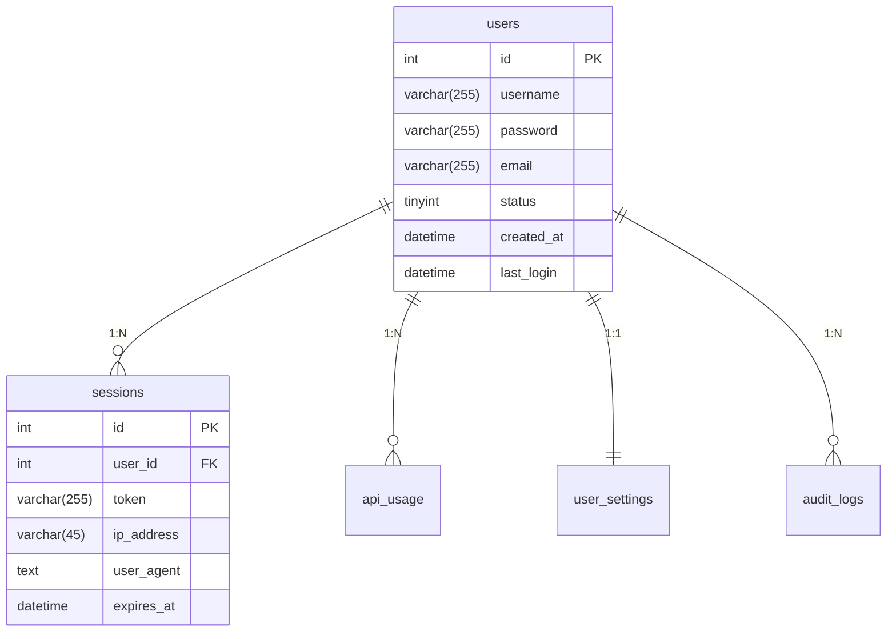

# 数据库设计文档

## 数据库架构设计

## 异常处理与日志追踪

1. **中间件日志配置**：
   - 在SecurityMiddleware中集成Monolog日志组件
   - 设置错误级别映射：
     ```php
     $logLevelMap = [
         DatabaseException::CLASS => Logger::ERROR,
         QueryTimeoutException::CLASS => Logger::ALERT
     ];
     ```

2. **全链路追踪**：
   - 在事务管理器中注入Request-ID
   - 使用DB::listen()记录慢查询：
     ```php
     DB::listen(function($query) {
         if ($query->time > 1000) {
             LogHelper::logSlowQuery($query);
         }
     });
     ```

3. **日志归档策略**：
   - 按小时滚动记录到logs/db_audit.log
   - 自动清理30天前日志


## 2. 数据表结构

### 2.1 users 用户表
| 字段 | 类型 | 说明 | 约束 |
|------|------|------|------|
| id | INT | 用户ID | PRIMARY KEY, AUTO_INCREMENT |
| username | VARCHAR(255) | 用户名 | NOT NULL, UNIQUE |
| password | VARCHAR(255) | 密码哈希 | NOT NULL |
| email | VARCHAR(255) | 邮箱 | NOT NULL, UNIQUE |
| status | TINYINT | 状态(0-禁用,1-正常) | DEFAULT 1 |
| created_at | DATETIME | 创建时间 | DEFAULT CURRENT_TIMESTAMP |
| last_login | DATETIME | 最后登录时间 | |

### 2.2 api_usage API调用记录
| 字段 | 类型 | 说明 |
|------|------|------|
| id | INT | 记录ID |
| user_id | INT | 用户ID |
| endpoint | VARCHAR(255) | API端点 |
| call_count | INT | 调用次数 |
| date | DATE | 记录日期 |

## 索引优化策略
```sql
-- 用户表索引
CREATE INDEX idx_users_username ON users(username);
CREATE INDEX idx_users_email ON users(email);

-- API调用记录索引
CREATE INDEX idx_api_usage_user ON api_usage(user_id);
CREATE INDEX idx_api_usage_date ON api_usage(date);
```

## 4. 数据关系
1. **用户-会话**: 一对多关系
2. **用户-API调用**: 一对多关系
3. **用户-设置**: 一对一关系
4. **用户-审计日志**: 一对多关系

## 5. 示例查询
```sql
-- 获取活跃用户列表
SELECT u.username, COUNT(a.id) as api_calls 
FROM users u
LEFT JOIN api_usage a ON u.id = a.user_id
WHERE u.status = 1
GROUP BY u.id
ORDER BY api_calls DESC;
```
