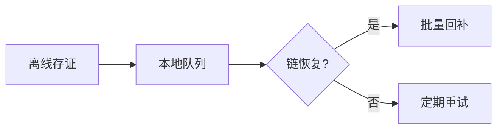
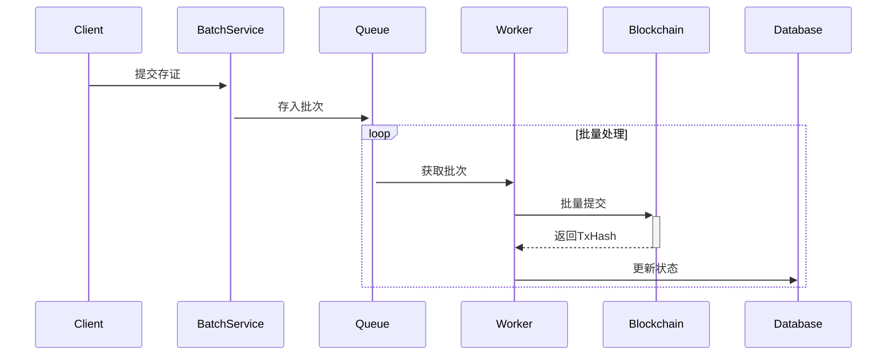

# 区块链高级功能指南

## 1. 存证回补机制

### 1.1 设计原理


### 1.2 核心接口
```php
interface RecoveryInterface {
    public function addOfflineEvidence(array $evidence): string;
    public function recover(string $batchId): array;
    public function verifyRecovery(string $txHash): bool;
}
```

### 1.3 配置示例
```yaml
# config/blockchain.php
'recovery' => [
    'max_retain_days' => 7,
    'check_interval' => 300, // 秒
    'batch_size' => 50
],
```

## 2. 性能优化

### 2.1 批量存证流程


### 2.2 调优参数
| 参数 | 默认值 | 建议范围 | 说明 |
|------|--------|----------|------|
| batch_size | 50 | 30-100 | 每批条目数 |
| timeout | 5000 | 3000-10000 | 批处理超时(ms) |
| workers | 4 | 2-8 | 并发工作进程 |

## 3. 监控集成

### 3.1 监控指标
```prometheus
# HELP chain_status Blockchain node status
chain_status{chain="fabric"} 1

# HELP evidence_queue_pending Pending evidence count
evidence_queue_pending 42
```

### 3.2 告警规则
```yaml
groups:
- name: blockchain
  rules:
  - alert: ChainDown
    expr: chain_status == 0
    for: 5m
    labels:
      severity: critical
    annotations:
      summary: "{{ $labels.chain }} chain unavailable"
```

## 4. 最佳实践

### 4.1 存证策略矩阵
| 操作类型 | 实时性 | 冗余链数 | 验证频率 |
|----------|--------|----------|----------|
| 登录审计 | 高 | 2 | 每日 |
| 数据变更 | 中 | 1 | 每周 |
| 配置修改 | 高 | 3 | 实时 |

[返回API参考](../api/blockchain.md) | [查看部署指南](../deployment.md)