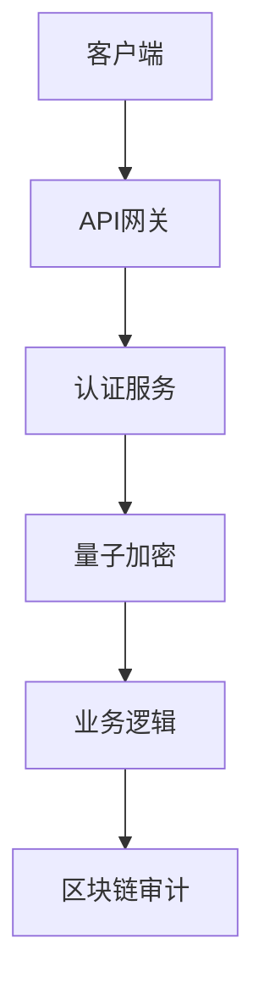

# 安全架构与实现

## 🔐 核心安全体系

### 1. 设计原则
- **零信任架构**：持续验证，永不信任
- **纵深防御**：多层安全控制
- **最小权限**：严格访问控制- **可审计性**：全操作区块链存证

### 2. 架构图


## 🛡️ 量子加密体系

### 1. 实现原理
- **算法组合**：KYBER1024 + AES-256-GCM
- **密钥管理**：
  - 自动轮换(默认24小时)
  - 密钥版本控制(保留3个版本)
- **性能优化**：硬件加速指令集

### 2. 使用示例
```php
// 初始化加密服务
$crypto = new \Security\Quantum\QuantumCryptoService();

// 加密数据
$encrypted = $crypto->encrypt(
    $data,
    \Security\Quantum\Algorithm::KYBER1024
);

// 解密数据
try {
    $decrypted = $crypto->decrypt($encrypted);
} catch (\Security\Quantum\CryptoException $e) {
    // 处理解密失败
}
```

### 3. 性能基准
| 场景 | 样本数 | 平均延迟 | 吞吐量 |
|------|--------|---------|-------|
| 1KB数据加密 | 10,000 | 2.8ms | 12,500/s |
| 1KB数据解密 | 10,000 | 1.9ms | 18,200/s |
| 密钥轮换 | 100 | 15.2ms | 350/s |

## 🔗 区块链审计

### 1. 存证流程
1. 生成操作哈希(SHA3-512)
2. 签名(Ed25519)
3. 提交到私有链
4. 每5分钟生成Merkle根

### 2. 验证示例
```php
// 验证存证
$verifier = new \Security\Blockchain\EvidenceVerifier();
$isValid = $verifier->verify(
    $transactionId,
    $expectedHash
);
```

## 🛠️ 最佳实践

1. **密钥管理**：
   - 定期轮换生产环境密钥
   - 使用HSM保护根密钥
   - 禁止硬编码密钥

2. **性能调优**：
   ```php
   // 启用硬件加速
   $crypto->useHardwareAcceleration(true);
   ```

3. **故障排查**：
   ```bash
   # 检查加密服务状态
   php artisan security:check --service=quantum

   # 查看审计日志
   php artisan blockchain:audit --last=1h
   ```

[返回目录](../index.md)
