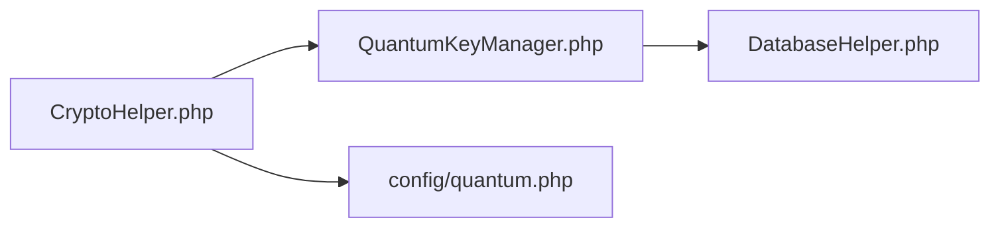
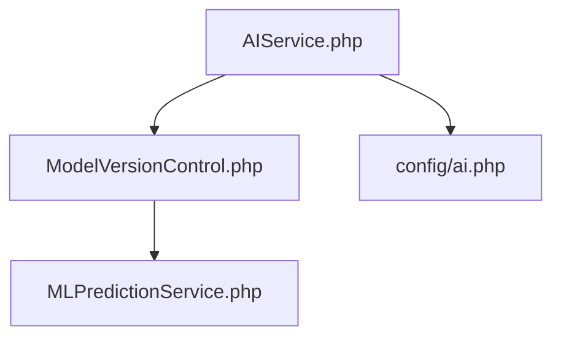

# stanfai-司单服Ai智能安全法务 文件结构与内容分析

## 根目录
- `README.md`：项目说明与功能总览
- `config.php`：全局配置，环境变量优先，初始化安全、数据库、API、合同等
- `install.php`：一键安装部署入口，自动检测环境、生成.env、初始化数据库、创建管理员
- `.env`：环境变量配置文件，推荐通过install.php自动生成
- `index.php`：系统首页，展示主界面与快捷入口
- `login.php`：登录入口，初始化登录控制器与表单
- `admin.php`：管理后台主页面，仪表盘、用户管理等
- `ai_companion_db.sql`：数据库初始化脚本，含自研合同、签约、法务表
- `db_fix_and_repair.php`：数据库修复脚本
- `create_audit_logs_table.php`：日志表创建脚本
- `test_encryption_flow.php`：加密流程测试

## libs/
### 量子加密相关文件
- `CryptoHelper.php`：
  - `initPQC()`：初始化量子加密
  - `quantumKeyRotate()`：密钥轮换
  - `quantumHealthCheck()`：健康检查
- `QuantumKeyManager.php`：
  - `generateKeyPair()`：密钥对生成
  - `distributeKeys()`：密钥分发
  - `revokeKeys()`：密钥撤销

### 文件关系

### 关键流程
1. 系统启动时调用`initPQC()`
2. 每日定时任务调用`quantumKeyRotate()`
3. 加密操作时自动选择量子或传统加密
  - `generateCsrfToken()/validateCsrfToken()`：CSRF令牌
  - `hashPassword()/verifyPassword()`：密码哈希与验证
  - `generateBiometricChallenge()/verifyBiometricSignature()`：生物识别签名与验证
  - `healthCheck()`：加密健康检查
- `DatabaseHelper.php`：数据库操作、安全查询、审计日志、密码强度、历史密码
  - `secureQuery()/getRow()/getRows()`：安全查询
  - `insert()/update()/delete()`：数据写操作
  - `logAudit()`：安全审计日志
  - `calculatePasswordStrength()`：密码强度计算
  - `isBiometricEnabled()/updateBiometricData()`：生物识别相关
  - `updateUserPassword()/isPasswordInHistory()`：密码历史
  - `testConnection()`：数据库连接测试

## controllers/
- `LoginController.php`：登录与认证
  - `login()`：主登录流程，支持2FA、生物识别
  - `verifyTotp()/generateTotpCode()`：TOTP验证
  - `useRecoveryCode()`：恢复码处理
  - `verifyBiometric()`：生物识别验证
  - `logout()`：安全登出
- `MonitorController.php`：系统监控
  - `metrics()`：获取监控指标
  - `dashboard()`：获取仪表盘数据
- `WebSocketController.php`：WebSocket令牌
  - `getAuthToken()`：生成认证令牌
  - `verifyToken()`：验证令牌
- `ContractController.php`：自研电子签约与法务流程控制器
  - `createTemplate()`：创建合同模板
  - `signContract()`：合同签署
  - `archiveContract()`：合同归档
  - `verifySignature()`：签名验证
  - `listContracts()`：合同检索
- `refactor/LoginController.refactor.php`：登录控制器重构示例

## services/
### AI服务相关文件
- `AIService.php`：
  - `trainModel()`：模型训练
  - `predict()`：预测服务
  - `evaluate()`：模型评估
- `ModelVersionControl.php`：
  - `deployModel()`：模型部署
  - `rollbackModel()`：版本回滚
- `MLPredictionService.php`：
  - `preprocess()`：数据预处理
  - `postprocess()`：结果后处理

### 文件关系

### 关键流程
1. 数据收集后调用`preprocess()`
2. 训练完成后调用`deployModel()`
3. 预测请求通过`predict()`处理
- `SystemMonitorService.php`：系统指标采集
  - `sampleMetrics()/getCurrentLoad()/getLoadTrend()`：指标采集与趋势
- `WebSocketService.php`：WebSocket服务端
  - `onOpen()/onMessage()/broadcastMetrics()`：连接与消息处理
  - `signMessage()/verifySignature()`：消息签名与验证
  - `compressMessage()/decompressMessage()`：消息压缩
- `ApiSignService.php`：API签名
  - `generateSignature()/verifySignature()`：API签名生成与验证
  - `validateTimestamp()`：防重放
- `LoginAnalyticsService.php`：登录行为分析
  - `analyzeLoginPattern()`：登录风险分析
- `RateLimitService.php`：速率限制与动态调整
  - `check()/getLimits()/calculateLoadAdjustment()`：速率限制与动态调整
- `ContractService.php`：自研合同与法务服务
  - `createTemplate()/signContract()/archiveContract()/verifySignature()/listContracts()`：合同全流程
- `aggregate_metrics.php`：指标聚合脚本

## middlewares/
- `AuthMiddleware.php`：认证
- `RateLimitMiddleware.php`：速率限制
- `SecurityMiddleware.php`：CSRF与安全头
- `BiometricMiddleware.php`：生物识别

## admin/
- `history.php`：历史监控，调用MonitorController
- `services/`：后台服务
- 其他管理页面

## contracts/
- `templates/`：合同模板存储
- `archive/`：合同归档与存证
- `sign/`：签名文件与流程
- `audit.log`：合同与法务操作日志

## js/
- `globe.js`：三维地球可视化，WebSocket实时数据推送，计数器动画，消息签名与解压

## styles/、css/
- `doc-viewer.css`：文档查看器样式
- 其他样式与主题

## logs/、cache/、sessions/
- 日志、缓存、会话存储

---

## 文件内容分析举例

### install.php
- 一键安装部署入口，自动检测PHP扩展、目录权限、数据库连通性，生成.env文件，导入数据库结构，创建管理员账号。适合首次部署和开发环境初始化。

### .env
- 环境变量配置文件，包含数据库、加密、应用、邮件等敏感配置，推荐通过install.php自动生成，避免手工编辑出错。

### libs/CryptoHelper.php
- 提供AES-256-GCM和量子加密支持，支持密钥轮换、健康检查、CSRF防护、密码哈希与验证、零知识证明等。
- 关键函数：`init()`、`encrypt()`、`decrypt()`、`quantumEncrypt()`、`quantumDecrypt()`、`generateCsrfToken()`、`verifyBiometricSignature()`。

### libs/DatabaseHelper.php
- 封装所有数据库操作，自动加密/解密敏感字段，支持安全查询、审计日志、密码强度、历史密码检查等。
- 关键函数：`secureQuery()`、`getRow()`、`insert()`、`update()`、`logAudit()`、`calculatePasswordStrength()`。

### controllers/LoginController.php
- 实现多因素认证、设备指纹、地理位置、密码强度、恢复码、会话安全等完整登录流程。
- 关键函数：`login()`、`verifyTotp()`、`useRecoveryCode()`、`verifyBiometric()`、`logout()`。

### services/WebSocketService.php
- 实现WebSocket消息签名、压缩、认证、广播，支持密钥轮换与安全验证。
- 关键函数：`onOpen()`、`onMessage()`、`broadcastMetrics()`、`signMessage()`、`verifySignature()`。

### controllers/ContractController.php
- 负责合同模板管理、合同签署、存证、归档、法务流程自动化等所有电子签约与法务功能，所有数据本地存储，签名算法支持RSA/ECC/国密，支持区块链存证和零知识证明（创新）。

### services/ContractService.php
- 实现合同签名、存证、归档、法务流程自动化等核心逻辑，支持合同内容加密、签名验证、归档检索、区块链存证、AI辅助合同风险分析等（创新）。

### js/globe.js
- Three.js三维地球可视化，WebSocket实时数据推送，计数器动画，消息签名与解压。

---

本系统所有合同、签约、法务相关功能均为广西港妙科技有限公司自主研发，严禁抄袭仿冒。
