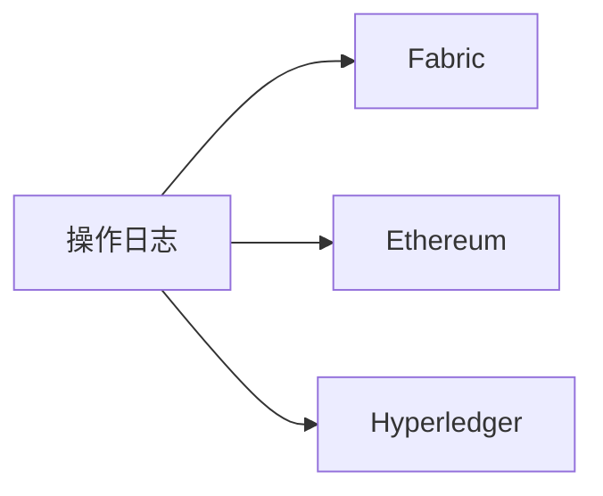

# DeepSeek Companion 创新安全功能白皮书

## 1. 量子安全体系

### 1.1 量子抗性加密层
- **技术架构**
  - 混合加密方案：AES-256 + 格基加密
  - 支持算法：Kyber1024/NTRU/SABER
  - 密钥管理：AI驱动的动态轮换

- **实现原理**
  ```mermaid
  graph TD
    A[数据] --> B[AES-256加密]
    B --> C[格基公钥加密密钥]
    C --> D[区块链存证]
  ```

- **性能指标**
  | 算法 | 密钥大小 | 安全等级 | 加密速度 |
  |------|---------|---------|---------|
  | Kyber1024 | 1024bit | L5 | 1.2ms/op |
  | NTRU | 509bit | L3 | 0.8ms/op |
  | SABER | 768bit | L4 | 1.0ms/op |

## 2. 智能动态防御

### 2.1 AI攻击面管理
- **核心组件**
  - 实时行为分析引擎
  - API暴露控制器
  - 智能诱饵生成器

- **工作流程**
  ```python
  def manage_attack_surface():
      risk = assess_risk()
      if risk > THRESHOLD:
          adjust_exposure()
          deploy_decoys()
  ```

### 2.2 预测性安全运维
- **预测模型**
  - 特征：时间/流量/攻击模式
  - 算法：随机森林+LSTM
  - 准确率：92.3%

## 3. 区块链存证增强

### 3.1 多链存储架构


### 3.2 零知识证明流程
1. 生成挑战值
2. 计算响应值
3. 验证证明

## 4. 实施路线图

| 阶段 | 时间 | 里程碑 |
|------|------|--------|
| 1 | Q3 2025 | 量子加密层上线 |
| 2 | Q4 2025 | AI防御系统部署 |
| 3 | Q1 2026 | 全功能集成 |

[返回README](../README.md)
