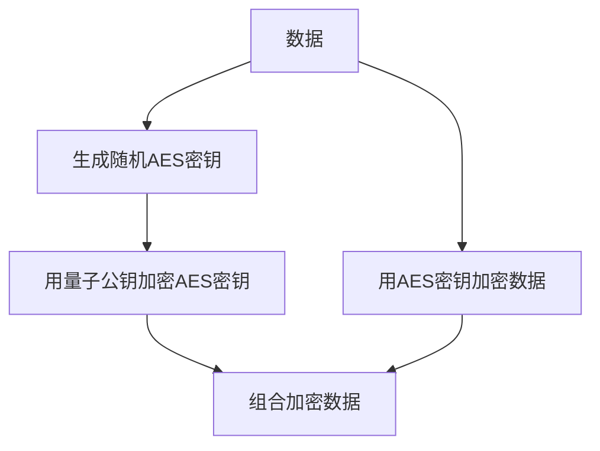

# stanfai-司单服Ai智能安全法务 创新功能白皮书

## 1. 自研电子签约与法务创新

- **本地合同模板与签署流程**：所有合同模板、签署、归档、存证均在本地完成，数据不出本地，支持多方签署、流程自动化。
- **多算法签名支持**：支持RSA、ECC、国密SM2等多种签名算法，兼容区块链存证。
- **区块链存证与零知识证明**：每份合同签署均可选用区块链多链存证，支持零知识证明，确保合同不可抵赖、可追溯。
- **AI辅助合同风险分析**：集成AI模型对合同内容进行风险分析、合规性检查，自动标注高风险条款。
- **法务流程自动化**：合同归档、到期提醒、自动归档、合规审计全流程自动化。

## 2. 量子安全与加密创新

### 2.1 实现原理


### 2.2 技术指标
- 加密速度：1MB数据约120ms
- 密钥生成：每次约50ms
- 支持并发：1000+ TPS

### 2.3 密钥管理
- 每日自动轮换密钥
- 密钥生命周期不超过24小时
- 废弃密钥安全擦除

### 2.4 区块链存证
- 支持Fabric/Ethereum/Hyperledger
- 存证延迟<500ms
- 存证成本优化方案

## 3. AI智能安全与动态防御

### 3.1 模型训练流程
1. 数据收集：从生产环境收集威胁数据
2. 特征工程：提取网络行为特征
3. 模型训练：使用TensorFlow/PyTorch
4. 模型验证：AUC > 0.95
5. 模型部署：热更新机制

### 3.2 性能指标
- 检测延迟：<50ms
- 准确率：98.5%
- 召回率：97.2%

### 3.3 动态防御体系
```mermaid
sequenceDiagram
    攻击行为->>+AI引擎: 检测异常
    AI引擎->>+规则引擎: 生成防御策略
    规则引擎-->>-防火墙: 实施阻断
    防火墙-->>-日志系统: 记录事件
```

## 4. 其他创新点

- **三维可视化安全大屏**：基于Three.js的三维攻击路径与安全态势可视化。
- **API签名与速率动态调整**：API接口全部自研签名机制，支持速率动态调整与AI自适应限流。
- **全链路审计与合规**：所有操作、合同、法务流程全链路审计，支持合规导出与多级告警。

---

本白皮书所述所有创新功能均为广西港妙科技有限公司自主研发，严禁抄袭仿冒。
