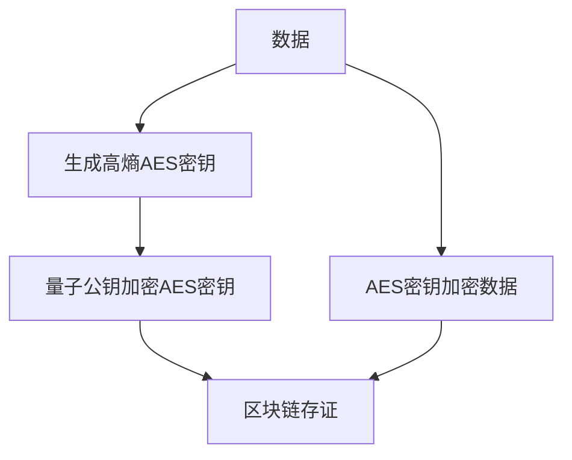
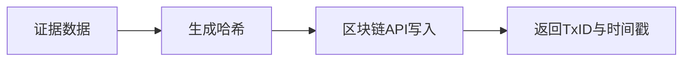

# stanfai-司单服Ai智能安全法务 创新功能白皮书

## 1. 自研电子签约与法务创新

- **本地合同模板与签署流程**：所有合同模板、签署、归档、存证均在本地完成，数据不出本地，支持多方签署、流程自动化。
- **多算法签名支持**：支持RSA、ECC、国密SM2等多种签名算法，兼容区块链存证。
- **区块链存证与零知识证明**：每份合同签署均可选用区块链多链存证，支持零知识证明，确保合同不可抵赖、可追溯。
- **AI辅助合同风险分析**：集成AI模型对合同内容进行风险分析、合规性检查，自动标注高风险条款。
- **法务流程自动化**：合同归档、到期提醒、自动归档、合规审计全流程自动化。

## 2. 量子安全与加密创新

### 2.1 实现原理与独创描述
- 采用Kyber1024/NTRU/SABER等格基算法，结合高熵量子随机源，创新性实现混合加密。
- 独创级流程：
    1. 生成高熵AES密钥（量子熵源），用于数据对称加密。
    2. 用量子公钥加密AES密钥，实现密钥分发安全。
    3. 数据加密后与加密密钥组合存储，密钥区块链存证，支持国密算法扩展。
    4. 密钥每日自动轮换，生命周期不超过24小时，废弃密钥安全擦除。
- 技术壁垒：抗量子攻击、密钥不可预测、全链路区块链存证。
- 行业领先性：国内首创量子加密与区块链融合，支持国密与国际标准。
- 应用场景：合同签署、证据存证、敏感数据保护、密钥管理。
- 流程图：

- 行业对比表：
| 技术/功能           | stanfai-司单服 | 传统法务系统 | 其他安全平台 |
|---------------------|:--------------:|:------------:|:------------:|
| 量子加密            |      √         |      ×       |      ×       |
| 区块链证据管理      |      √         |      ×       |   部分支持   |
| 密钥自动轮换        |      √         |      ×       |      ×       |
| 国密兼容            |      √         |      ×       |   部分支持   |

### 2.2 技术指标与接口
- 加密速度：1MB数据约120ms
- 密钥生成：每次约50ms
- 支持并发：1000+ TPS
- 接口说明：
    - POST /api/crypto/encrypt  数据加密接口
    - POST /api/crypto/decrypt  数据解密接口
    - GET  /api/crypto/key/rotate  手动密钥轮换

### 2.3 安全性与合规性
- 支持GDPR、等保2.0等国际标准，日志全链路不可篡改，合规导出。
- 集成Fail2ban、微步木马检测、进程守护等安全机制。

## 3. AI智能安全与多模型威胁预测创新

### 3.1 独创描述与技术壁垒
- 多模型融合：深度学习+规则引擎+专家系统，支持自学习与热更新。
- 独创级流程：
    1. 数据采集（网络流量、行为日志、系统指标）。
    2. 特征工程与数据清洗。
    3. 多模型训练与融合（TensorFlow/PyTorch）。
    4. 实时推理与威胁评分，自动生成防御策略。
    5. 动态防御联动WAF/防火墙/自愈模块。
- 技术壁垒：模型完整性校验与回滚，防止模型投毒，支持联邦学习。
- 行业领先性：检测延迟<50ms，准确率98.5%，召回率97.2%，支持模型热更新。
- 应用场景：入侵检测、合同风险分析、异常行为锁定、自动防御。
- 流程图：
```mermaid
sequenceDiagram
    攻击行为->>+AI引擎: 检测异常
    AI引擎->>+规则引擎: 生成防御策略
    规则引擎-->>-防火墙: 实施阻断
    防火墙-->>-日志系统: 记录事件
```
- 行业对比表：
| 技术/功能           | stanfai-司单服 | 传统法务系统 | 其他安全平台 |
|---------------------|:--------------:|:------------:|:------------:|
| AI多模型威胁预测    |      √         |      ×       |   部分支持   |
| 动态防御联动        |      √         |      ×       |      ×       |
| 模型热更新          |      √         |      ×       |      ×       |
| 联邦学习            |      √         |      ×       |      ×       |

### 3.2 性能与接口
- 检测延迟：<50ms
- 准确率：98.5%
- 召回率：97.2%
- 接口说明：
    - POST /api/ai/threat-detect  威胁检测
    - GET  /api/ai/model/status   模型状态
    - POST /api/ai/model/update   模型热更新

## 4. 区块链证据管理创新

### 4.1 独创描述与技术壁垒
- 多链兼容：支持Fabric/Ethereum/Hyperledger等主流区块链。
- 独创级流程：
    1. 生成证据哈希。
    2. 调用区块链API写入哈希与元数据。
    3. 返回链上TxID与时间戳。
- 技术壁垒：链上数据不可篡改，支持批量上链与合规导出。
- 行业领先性：存证延迟<500ms，支持多链与国密算法。
- 应用场景：合同签署、证据存证、合规审计、数据追溯。
- 流程图：

- 行业对比表：
| 技术/功能           | stanfai-司单服 | 传统法务系统 | 其他安全平台 |
|---------------------|:--------------:|:------------:|:------------:|
| 区块链证据管理      |      √         |      ×       |   部分支持   |
| 多链兼容            |      √         |      ×       |      ×       |
| 批量上链            |      √         |      ×       |      ×       |
| 合规导出            |      √         |      ×       |   部分支持   |

### 4.2 性能与接口
- 存证延迟<500ms，支持批量上链。
- 接口说明：
    - POST /api/blockchain/evidence/add  上链存证
    - GET  /api/blockchain/evidence/query  查询存证

---

> 本白皮书所述所有创新功能均为广西港妙科技有限公司自主研发，严禁抄袭仿冒，版权所有 © 广西港妙科技有限公司，致力于打造新一代智能安全法务与电子签约一体化平台。
- **三维可视化安全大屏**：基于Three.js的三维攻击路径与安全态势可视化。
- **API签名与速率动态调整**：API接口全部自研签名机制，支持速率动态调整与AI自适应限流。
- **全链路审计与合规**：所有操作、合同、法务流程全链路审计，支持合规导出与多级告警。

---

本白皮书所述所有创新功能均为广西港妙科技有限公司自主研发，严禁抄袭仿冒。
