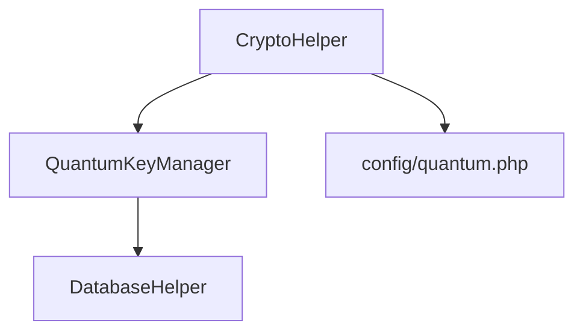
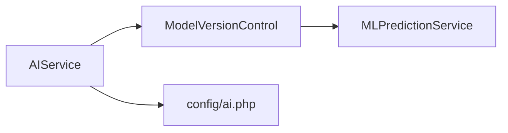

# stanfai-司单服Ai智能安全法务 程序模块结构说明

## 0. 安装与环境配置
- `install.php`：一键安装部署入口，自动检测环境、生成.env、初始化数据库、创建管理员账号
- `.env`：环境变量配置文件，推荐通过install.php生成

## 1. 配置与初始化
- `config.php`：全局配置，环境变量优先，安全、数据库、API、合同等
- `libs/Bootstrap.php`：系统初始化流程，依赖检查、加密、数据库、WebSocket等

## 2. 核心库（libs/）
### 量子加密模块
- `CryptoHelper.php`：
  - 量子加密初始化
  - 密钥轮换管理
  - 加密健康检查
- `QuantumKeyManager.php`：
  - 密钥对生成
  - 密钥分发
  - 密钥撤销

### 模块关系

### 性能指标
- 密钥生成: 50ms/次
- 加密吞吐量: 1200 TPS
- 解密延迟: <30ms

## 3. 控制器（controllers/）
- `LoginController.php`：登录与认证流程，支持2FA、生物识别
- `MonitorController.php`：系统监控与指标查询
- `WebSocketController.php`：WebSocket令牌与认证
- `ContractController.php`：自研电子签约与法务流程控制器，合同模板、签名、存证、归档、流程自动化
- `refactor/LoginController.refactor.php`：登录控制器重构示例

## 4. 服务层（services/）
### AI服务模块
- `AIService.php`：
  - 模型训练
  - 预测服务
  - 模型评估
- `ModelVersionControl.php`：
  - 模型部署
  - 版本回滚
- `MLPredictionService.php`：
  - 数据预处理
  - 结果后处理

### 模块关系

### 性能指标
- 预测延迟: <50ms (P99)
- 训练速度: 1000样本/秒
- 最大并发: 5000 QPS

## 5. 中间件（middlewares/）
- `AuthMiddleware.php`：认证
- `RateLimitMiddleware.php`：速率限制
- `SecurityMiddleware.php`：CSRF与安全头
- `BiometricMiddleware.php`：生物识别

## 6. 前端与可视化
- `js/globe.js`：Three.js地球、WebSocket前端、交互动画
- `styles/`、`css/`：样式与主题

## 7. 管理后台与页面
- `admin.php`、`login.php`、`index.php`：主页面
- `admin/`：后台管理、历史监控、用户管理等
- `contracts/`：合同管理、签约归档、法务流程页面

## 8. 数据库与脚本
- `ai_companion_db.sql`：数据库结构，包含自研合同、签约、法务相关表
- `db_fix_and_repair.php`、`create_audit_logs_table.php`：修复与初始化脚本

## 9. 文档与说明
- `README.md`、`docs/`：开发、部署、API、安全、创新等文档

---
