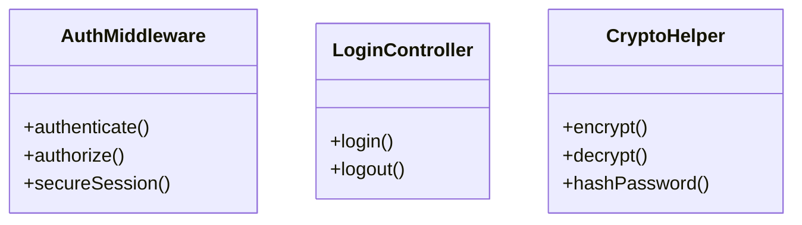
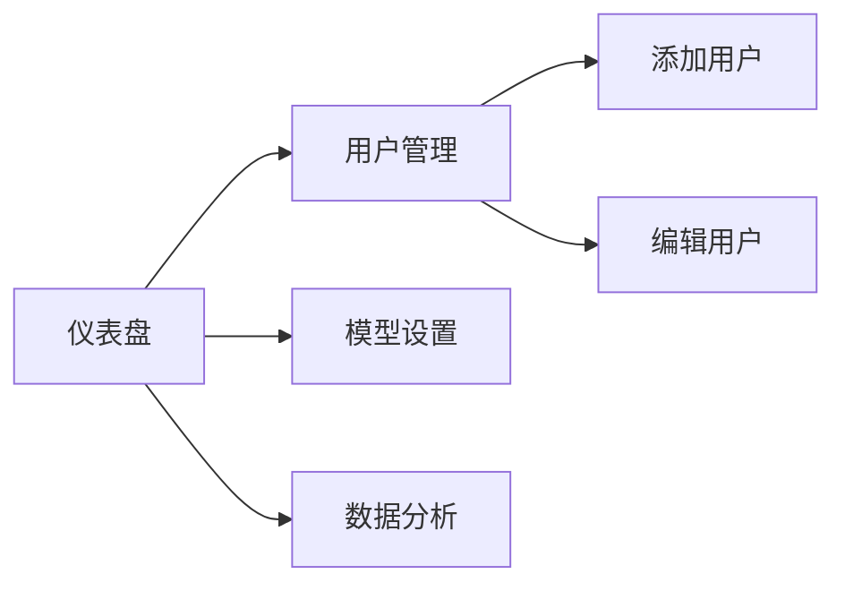

# 系统模块说明

## 1. 认证模块

### 功能概述
- 用户登录/注销
- 会话管理
- 权限验证
- 密码加密

### 核心类


### 关键代码
```php
// 认证流程示例
public function authenticate() {
    // 1. 检查管理员跳过
    if ($this->checkAdminBypass()) return;
    
    // 2. 验证会话
    $this->validateSession();
    
    // 3. 检查权限
    $this->authorize($requiredRole);
}
```

## 2. 加密模块

### 核心功能
- AES-256-CBC数据加密
- 自定义编码/解码
- 密码哈希
- 密钥轮换

### 配置参数
| 参数 | 类型 | 说明 |
|------|------|------|
| ENCRYPTION_KEY | string | 32字节加密密钥 |
| ENCRYPTION_IV | string | 16字节初始化向量 |
| ENCRYPTION_METHOD | string | AES-256-CBC |

## 3. 数据统计模块

### 功能列表
1. 用户数据统计
   - 总用户数
   - 活跃用户
   - 地域分布

2. API调用统计
   - 调用次数
   - 成功率
   - 响应时间

## 4. 管理后台模块

### 功能结构


### 界面组件
- Bootstrap卡片
- Chart.js图表
- 数据表格
- 表单控件
