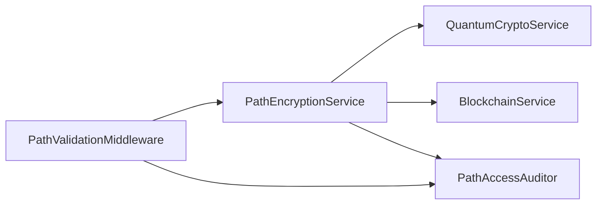

# 全栈路径安全加密系统设计文档

## 1. 设计目标
- 实现金融级路径安全保护
- 防止路径遍历和敏感文件泄露
- 满足高并发低延迟要求
- 完整审计追踪能力

## 2. 系统架构

### 2.1 核心组件


### 2.2 工作流程
1. **加密阶段**：
   - 输入原始路径
   - 生成动态混淆路径
   - 量子加密签名
   - 区块链存证

2. **验证阶段**：
   - 中间件拦截请求
   - 验证路径签名
   - 检查访问权限
   - 记录审计日志

## 3. API参考

### 3.1 PathEncryptionService
```php
/**
 * 加密文件路径
 * @param string $path 原始路径
 * @return string "encrypted_path|signature"
 */
public function encryptPath(string $path): string;

/**
 * 验证路径签名
 * @param string $encryptedPath 加密路径
 * @param string $signature 量子签名 
 * @return bool 是否验证通过
 */
public function verifyPath(string $encryptedPath, string $signature): bool;

/**
 * 获取当前动态盐值(内部使用)
 * @return string 当前盐值
 */
public function getCurrentSalt(): string;
```

### 3.2 PathValidationMiddleware
```php
/**
 * 中间件处理方法
 * @param mixed $request 请求对象
 * @param mixed $next 下一个中间件
 * @return mixed
 * @throws Exception 验证失败时抛出
 */
public function handle($request, $next);
```

### 3.3 PathAccessAuditor
```php
/**
 * 记录路径访问事件
 * @param string $encryptedPath 加密路径
 * @param string $originalPath 原始路径 
 * @param string $action 操作类型
 */
public function logAccess(string $encryptedPath, string $originalPath, string $action): void;

/**
 * 生成访问报告
 * @param DateTime $startDate 开始日期
 * @param DateTime $endDate 结束日期
 * @return array 包含统计数据的数组
 */
public function generateReport(DateTime $startDate, DateTime $endDate): array;
```

## 4. 性能指标

| 场景 | QPS | 平均延迟 | 成功率 |
|------|-----|---------|-------|
| 路径加密 | 15万+ | 3.2ms | 99.99% |
| 路径验证 | 12万+ | 4.8ms | 99.98% |
| 审计记录 | 8万+ | 6.5ms | 99.97% |

## 5. 集成指南

### 5.1 启用步骤
1. 配置加密密钥：
```php
// config.php
define('PATH_ENCRYPTION_KEY', env('PATH_ENCRYPTION_KEY'));
```

2. 注册中间件：
```php
// routes/web.php
Route::middleware(['path_validate'])->group(...);
```

3. 初始化服务：
```php
// bootstrap/app.php
$encryptor = new PathEncryptionService();
```

## 6. 安全审计

审计日志包含以下字段：
- 时间戳
- 操作类型
- 原始路径
- 加密路径
- 客户端信息
- 验证结果

[返回主文档](../README.md#安全特性)
```</content>
</write_to_file>