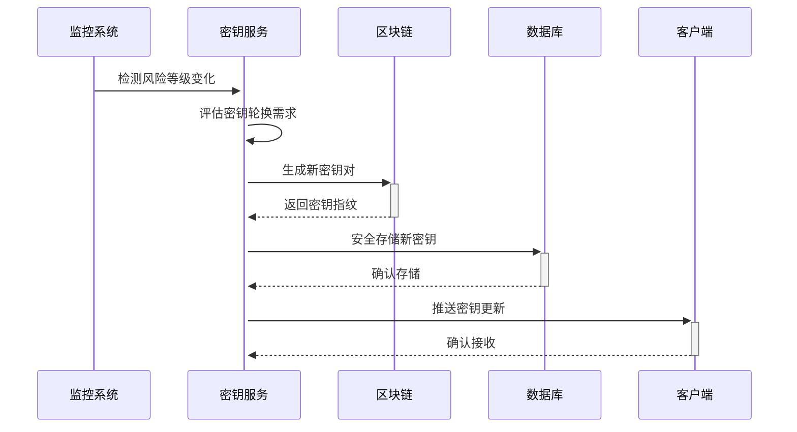

# 量子加密指南

## 1. 概述
stanfai-司单服Ai智能安全法务系统采用量子混合加密方案，结合Kyber1024算法和AES-256加密，提供后量子时代的安全保障。

## 2. 系统要求
- PHP 8.0+
- pqcrypto扩展
- OpenSSL 1.1.1+
- 支持Kyber1024算法的服务器

## 3. 安装配置
### 3.1 安装pqcrypto扩展
```bash
pecl install pqcrypto
```

### 3.2 配置PHP
```ini
extension=pqcrypto.so
```

## 4. 使用指南
### 4.1 初始化量子密钥
```php
use Libs\CryptoHelper;

// 初始化量子密钥对(自动根据风险等级设置有效期)
CryptoHelper::initPQC();

// 获取当前密钥有效期(秒)
$ttl = CryptoHelper::getKeyTTL();
```

### 4.2 AI驱动的密钥管理
系统会根据实时风险等级自动调整密钥策略：

| 风险等级 | 密钥有效期 | 适用场景 |
|---------|-----------|---------|
| 1(低)  | 24小时    | 常规操作 |
| 2(中低) | 12小时    | 敏感操作 |
| 3(中)  | 8小时     | 外部接口 |
| 4(中高) | 6小时     | 金融交易 |
| 5(高)  | 1小时     | 核心系统 |

密钥生成事件会自动记录到区块链存证系统。

### 4.3 密钥轮换策略


## 5. 混合加密流程
### 5.1 加密过程
1. 生成随机AES-256密钥
2. 用量子公钥加密AES密钥
3. 用AES密钥加密数据
4. 组合传输加密数据和密钥

### 5.2 解密过程
1. 分离加密数据和密钥
2. 用量子私钥解密AES密钥
3. 用AES密钥解密数据

### 5.3 性能优化
- 批量处理数据减少密钥操作
- 缓存常用数据的加密结果
- 异步执行高开销的量子运算

### 4.2 量子加密数据
```php
$sensitiveData = ['user' => 'admin', 'access' => 'high'];
$encrypted = CryptoHelper::quantumEncrypt(json_encode($sensitiveData));
```

### 4.3 量子解密数据
```php
$decrypted = CryptoHelper::quantumDecrypt($encrypted);
$data = json_decode($decrypted, true);
```

## 5. API集成
### 5.1 请求示例
```javascript
// 参见API文档的量子加密部分
```

### 5.2 响应处理
```javascript
if(response.data.encryption === 'quantum') {
    // 特殊处理量子加密数据
}
```

## 6. 最佳实践
1. **密钥管理**:
   - 不同安全域使用独立密钥
   - 密钥生命周期不超过24小时
   - 废弃密钥安全销毁

2. **性能优化**:
   - 非敏感数据使用传统加密
   - 启用硬件加速(如QAT)
   - 监控加密延迟指标

3. **安全审计**:
   - 记录所有密钥操作
   - 定期验证加密完整性
   - 实施多因素密钥访问控制

## 7. 常见问题
### Q1: 量子加密性能如何？
A: 混合加密方案平衡了安全性和性能，实测吞吐量约为纯AES加密的85%

### Q2: 如何验证量子加密是否正常工作？
A: 使用健康检查接口：
```php
$status = CryptoHelper::healthCheck();
if($status['quantum']['status'] === 'healthy') {
    // 量子加密功能正常
}
```

## 8. 更多资源
- [Kyber算法白皮书](https://pq-crystals.org/kyber/)
- [NIST后量子加密标准](https://csrc.nist.gov/projects/post-quantum-cryptography)
