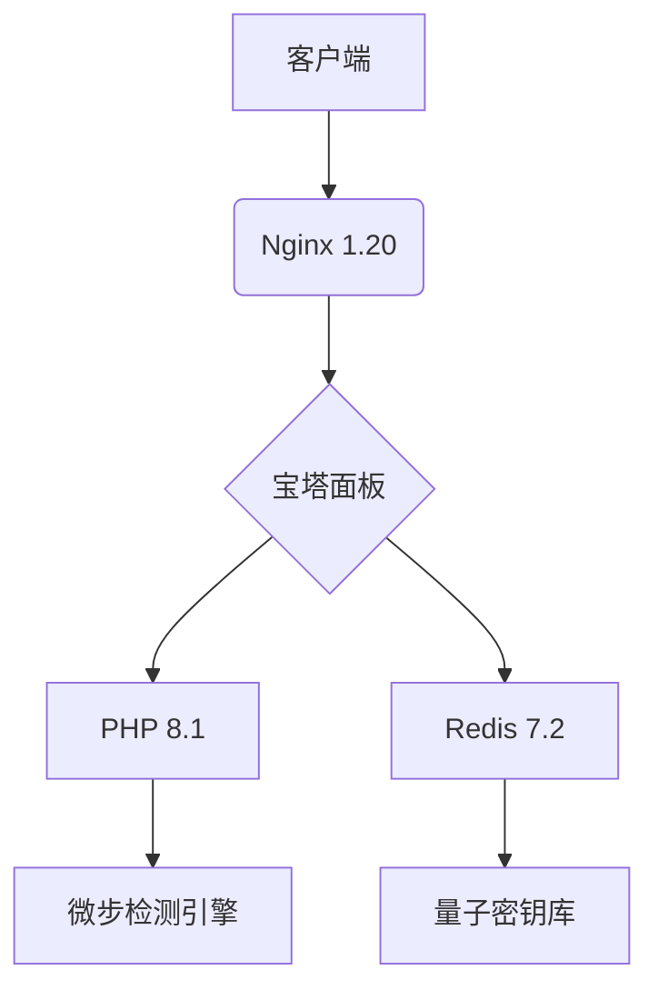
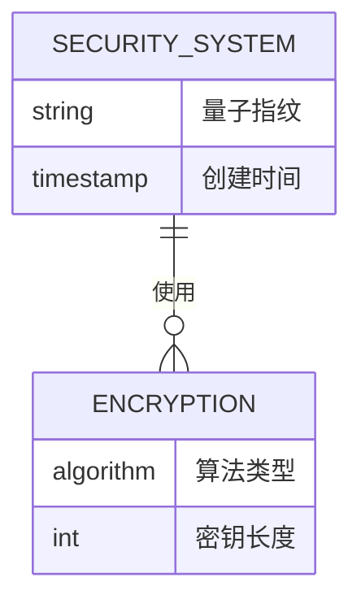
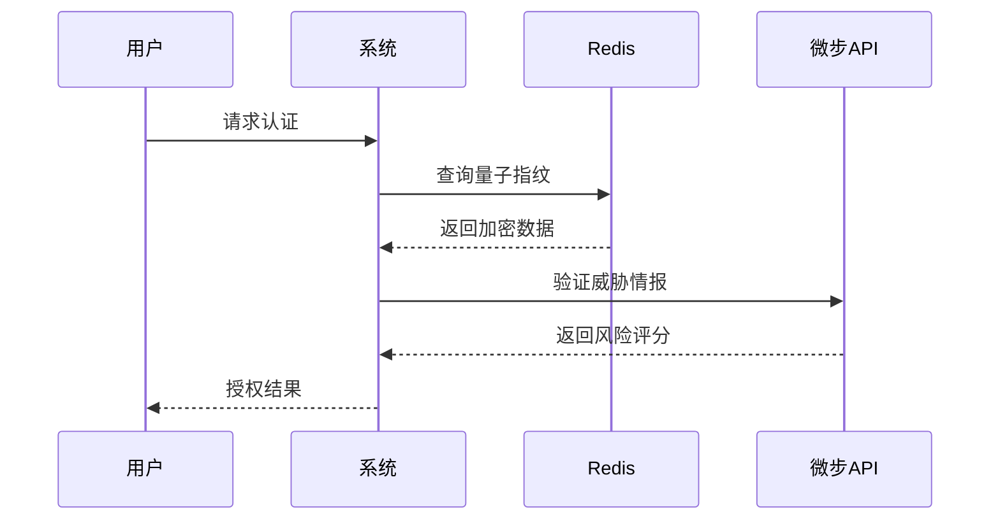

# 可视化文档模板库

## 系统架构图模板

```mermaid
flowchart TD
    A[客户端] --> B(Nginx 1.20)
    B --> C{宝塔面板}
    C --> D[PHP 8.1]
    C --> E[Redis 7.2]
    D --> F[微步检测引擎]
    E --> G[量子密钥库]
```

## 数据流图模板

```mermaid
erDiagram
    SECURITY_SYSTEM ||--o{ ENCRYPTION : 使用
    SECURITY_SYSTEM {
        string 量子指纹
        timestamp 创建时间
    }
    ENCRYPTION {
        algorithm 算法类型
        int 密钥长度
    }
```

## 交互流程图模板

```mermaid
sequenceDiagram
    participant 用户
    participant 系统
    用户->>系统: 请求认证
    系统->>Redis: 查询量子指纹
    Redis-->>系统: 返回加密数据
    系统->>微步API: 验证威胁情报
    微步API-->>系统: 返回风险评分
    系统-->>用户: 授权结果
```