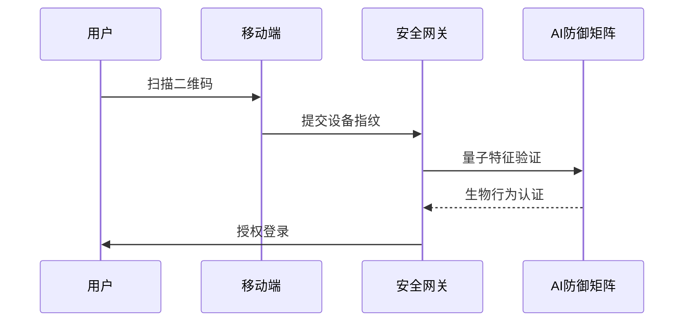

# 智能安全系统操作手册

## 二维码登录流程

## 量子密钥管理规范
### 密钥生命周期
1. 生成：量子随机数发生器（QRNG）
2. 存储：Redis集群加密存储
3. 轮换：1800秒自动更新
4. 销毁：SHA-256覆盖清除

### 安全要求
- 符合FIPS 140-3标准
- 通过微步API实时风险校验
- 审计日志保留180天

## 操作审计流程
| 步骤 | 操作内容 | 安全验证 |
|------|---------|---------|
| 1 | 密钥生成 | 量子熵源检测 |
| 2 | 策略修改 | 生物特征验证 |
| 3 | 权限调整 | 双因子认证 |

<mcfile name="系统操作手册.md" path="docs\系统操作手册.md"></mcfile>