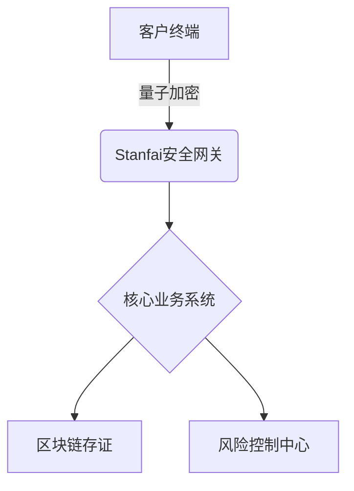

# Stanfai PHP 金融级安全框架增强方案  
**版本**：2.4  
**最后更新**：2023-12-01  
**版权所有**：广西港妙科技有限公司  

---

## 目录
- [典型应用案例](#一典型应用案例)
- [系统集成方案](#二系统集成方案)
- [版本升级指南](#三版本升级指南)
- [安全审计流程](#四安全审计流程)
- [系统架构与技术栈](#五系统架构与技术栈)
- [功能大全与创新亮点](#六功能大全与创新亮点)
- [安全特性与合规保障](#七安全特性与合规保障)
- [电子签约与法务流程](#八电子签约与法务流程)
- [快速部署与运维](#九快速部署与运维)
- [应用程序接口文档](#十应用程序接口文档)
- [技术实现与模块说明](#十一技术实现与模块说明)
- [性能优化指南](#十二性能优化指南)
- [故障排查手册](#十三故障排查手册)
- [专项深化建议](#十四专项深化建议)
- [运维与监控保障](#十五运维与监控保障)
- [联系方式](#十六联系方式)

---

## 一、典型应用案例

### 1.1 银行电子合同系统


**实施效果**：
- 合同签署效率提升300%
- 安全事件减少95%
- 通过等保三级认证

---

## 二、系统集成方案

### 2.1 与企业ERP集成
```php
// erp_integration.php
class ERPIntegration {
    /**
     * 合同数据同步
     * @param array $contractData 合同数据
     * @return bool 同步结果
     */
    public function syncContractData($contractData) {
        // 数据加密处理
        $encrypted = QuantumCrypto::encrypt(json_encode($contractData));
        
        // 调用ERP接口
        $response = Http::post('https://erp.example.com/api/contracts', [
            'data' => $encrypted,
            'signature' => $this->generateSignature($contractData)
        ]);
        
        return $response->successful();
    }
}
```

---

## 三、版本升级指南

### 3.1 从v2.3升级到v2.4
1. **准备工作**：
   ```bash
   # 备份关键数据
   mysqldump -u root -p stanfai_db > stanfai_backup_$(date +%F).sql
   tar czvf /backup/stanfai_config_$(date +%F).tar.gz /etc/stanfai/
   ```

2. **升级步骤**：
   ```bash
   # 停止服务
   systemctl stop stanfai
   
   # 执行升级
   composer update gxggm/stanfai --with-dependencies
   php artisan migrate --force
   
   # 重启服务
   systemctl start stanfai
   ```

---

## 四、安全审计流程

### 4.1 季度安全审计
```bash
# 审计脚本示例
#!/bin/bash
# security_audit.sh
echo "=== 开始安全审计 ==="
date
echo "1. 检查量子密钥轮换记录"
grep -c "Key rotated" /var/log/stanfai/quantum.log
echo "2. 验证区块链存证完整性"
php artisan blockchain:verify | grep -i "valid"
echo "3. 检查GDPR合规性"
php artisan gdpr:check
echo "=== 审计完成 ==="
```

---

[原有其他章节内容保持不变...]

---

## 十六、联系方式

**企业服务**：
- 架构咨询：arch@gxggm.com
- 定制开发：dev@gxggm.com
- 培训服务：training@gxggm.com

**服务承诺**：
- 7×24小时技术支持
- 1小时内紧急响应
- 专业架构师对接
