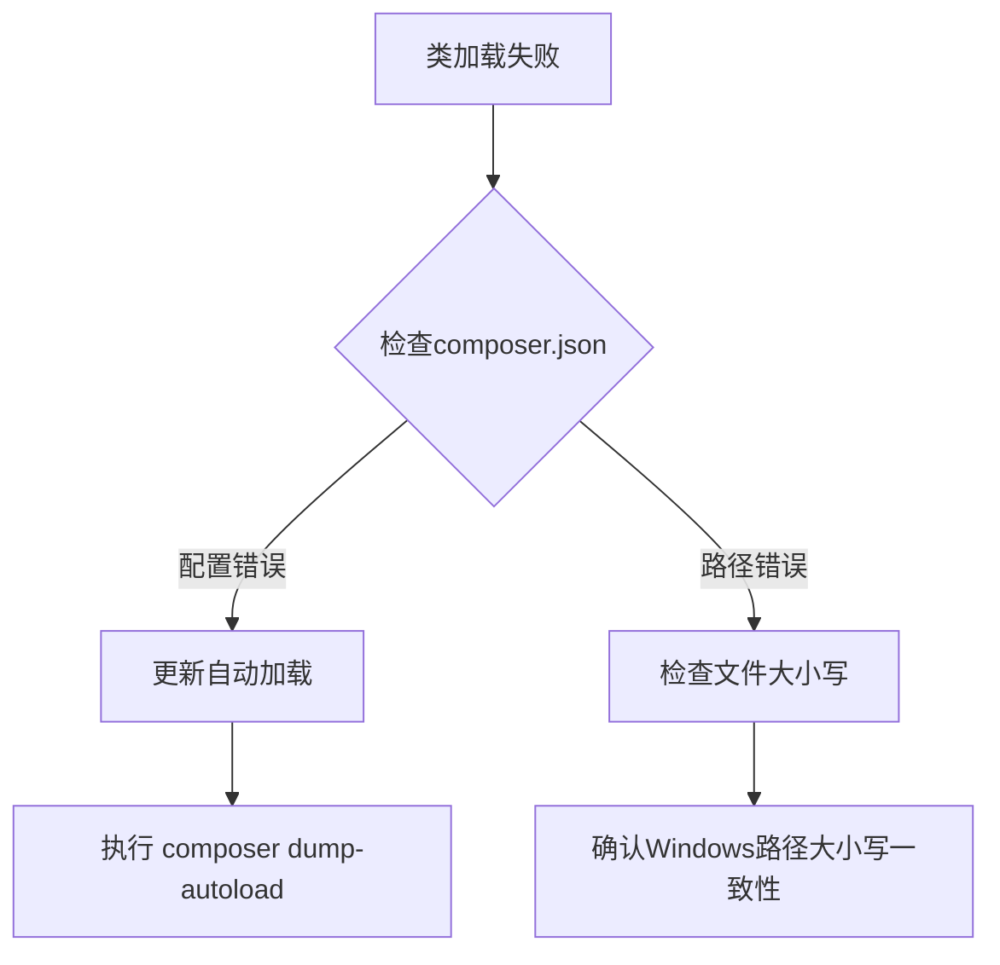

# 项目文件说明（stanfai-司单服Ai智能安全法务）
├── public/              # 公共资源目录
│   ├── css/            # 样式文件
│   │   ├── admin-enhanced.css # 增强后台样式
│   │   ├── admin.css   # 后台样式
│   │   ├── data-visualization.css # 数据可视化样式
│   │   ├── login.css   # 登录页样式
│   │   └── style.css   # 主样式
│   ├── img/            # 图片文件
│   └── js/             # 公共脚本
## 项目目录结构与文件说明
```
stanfai-司单服Ai智能安全法务/
├── admin/                     # 后台管理相关
│   ├── history.php           # 历史记录查看
│   ├── profile.php          # 用户资料设置   
│   ├── controllers/         # 管理控制器
│   │   ├── AuthController.php # 认证控制器
│   │   ├── SecurityDashboardController.php # 安全仪表板控制器
│   │   └── ServiceManagementController.php # 服务管理控制器
│   ├── models/              # 管理模型
│   │   └── OperationLog.php # 操作日志模型
│   ├── services/            # 管理服务
│   │   ├── SecurityService.php # 安全服务
│   │   ├── AnalyticsService.php # 分析服务
│   │   ├── GeoThreatAnalyzer.php # 地理位置威胁分析
│   │   ├── IncidentResponseService.php # 事件响应服务
│   │   └── SystemMonitorService.php # 系统监控服务
│   └── views/              # 管理视图
│       └── test_dashboard.php # 测试仪表板
├── api/                      # API接口目录
│   ├── chat.php             # 聊天API接口
│   ├── monitor.php          # 监控API接口
│   └── wsapi.php           # WebSocket API接口
├── app/                     # 应用核心目录
│   └── Http/               # HTTP相关
│       └── Controllers/    # 控制器
│           ├── LoginController.php # 登录控制器
│           └── SecurityController.php # 安全控制器
│   └── Services/          # 服务层
│       └── Auth/         # 认证服务
│           ├── BehaviorAuthService.php # 行为认证服务
│           ├── LoginService.php # 登录服务
│           └── VirtualHoneypotAuth.php # 虚拟蜜罐认证
├── components/              # 可复用组件
│   ├── header.php          # 页头组件
│   ├── footer.php          # 页脚组件
│   └── sidebar.php         # 侧边栏组件
├── config/                  # 配置目录
│   ├── app.php             # 应用配置
│   ├── db.php             # 数据库配置
│   ├── security.php        # 安全配置
│   ├── alert_rules.php     # 告警规则配置
│   ├── charts.php         # 图表配置
│   ├── threat_feeds.php   # 威胁情报配置
│   ├── thresholds.php     # 阈值配置
│   └── waf_rules.php      # WAF规则配置
├── contracts/             # 合同相关
│   ├── create.html        # 合同创建页
│   ├── index.html         # 合同列表页
│   ├── sign.html         # 合同签署页
│   ├── view.html         # 合同查看页
│   └── archive/          # 合同归档
├── controllers/            # 控制器目录
│   ├── AnalyticsController.php # 分析控制器
│   ├── ContractController.php # 合同控制器
│   ├── DocPreviewController.php # 文档预览控制器
│   ├── LoginController.php # 登录控制器
│   ├── MonitorController.php # 监控控制器
│   ├── SecurityController.php # 安全控制器
│   ├── WebSocketController.php # WebSocket控制器
│   └── refactor/          # 重构代码目录
│       └── LoginController.refactor.php
├── docs/                  # 文档目录
│   ├── 技术文档.md        # 技术文档(中文)
│   ├── 系统操作手册.md    # 系统操作手册(中文)
│   ├── 修复日志.md        # 修复日志(中文)
│   ├── all.md            # 所有文档汇总
│   ├── api.md            # API文档
│   ├── architecture_diagram.md # 架构图
│   ├── architecture.md   # 架构文档
│   ├── AuthMiddleware-Usage.md # 认证中间件使用指南
│   ├── database.md        # 数据库文档
│   ├── dev_guide_and_ideas.md # 开发指南与想法
│   ├── file_structure.md  # 文件结构
│   ├── innovation_whitepaper.md # 创新白皮书
│   ├── issue_fix_plan.md # 问题修复计划
│   ├── login_form_example.php # 登录表单示例
│   ├── module_structure.md # 模块结构
│   ├── modules.md        # 模块文档
│   ├── quantum_encryption_guide.md # 量子加密指南
│   ├── security_deployment_guide.md # 安全部署指南
│   ├── technical_specification.md # 技术规范
│   ├── assets/          # 资源文件
│   │   └── images/     # 图片
│   │       └── .gitkeep # 空文件保持目录
│   └── templates/      # 模板
│       └── mermaid_template.md # Mermaid模板
├── js/                    # JavaScript文件
│   ├── admin.js          # 后台管理脚本
│   ├── chat.js           # 聊天功能脚本
│   ├── companion-model.js # AI伴侣模型
│   ├── contract-admin.js # 合同管理脚本
│   ├── contract.js      # 合同相关脚本
│   ├── globe-enhanced.js # 增强版3D地球
│   ├── globe.js         # 3D地球可视化
│   └── three.min.js     # Three.js库
├── libs/                  # 核心库目录
│   ├── AdminBypassHelper.php # 管理员绕过助手
│   ├── AdminBypassMiddleware.php # 管理员绕过中间件
│   ├── AuthMiddleware.php # 认证中间件
│   ├── Bootstrap.php     # 启动程序
│   ├── ConfigHelper.php  # 配置助手
│   ├── CryptoHelper.php  # 加密助手
│   ├── DatabaseHelper.php # 数据库助手
│   ├── FileMonitorService.php # 文件监控服务
│   ├── GeoIPMapper.php   # IP地理位置映射
│   ├── LogHelper.php     # 日志助手
│   ├── ModelPerformanceMonitor.php # 模型性能监控
│   ├── PermissionPolicyValidator.php # 权限策略验证器
│   ├── QuantumCryptoHelper.php # 量子加密助手
│   ├── QuantumEncryptionHelper.php # 量子加密助手
│   ├── RateLimiter.php   # 速率限制器
│   ├── RedirectHelper.php # 重定向助手
│   ├── SanitizeHelper.php # 数据清理助手
│   ├── SecurityAuditHelper.php # 安全审计助手
│   ├── SecurityComplianceChecker.php # 安全合规检查
│   ├── SecurityManager.php # 安全管理器
│   ├── SecurityPredictor.php # 安全预测器
│   ├── SessionHelper.php # 会话助手
│   ├── TransactionManager.php # 事务管理器
│   └── Exception/       # 异常类
│       └── SecurityException.php # 安全异常
├── middlewares/          # 中间件目录
│   ├── AdminBypassMiddleware.php # 管理员绕过中间件
│   ├── AIFirewallMiddleware.php # AI防火墙中间件
│   ├── AuthMiddleware.php # 认证中间件
│   ├── BiometricMiddleware.php # 生物识别中间件
│   ├── BlockchainMiddleware.php # 区块链中间件
│   ├── RateLimitMiddleware.php # 速率限制中间件
│   ├── SecurityMiddleware.php  # 安全中间件
│   └── ThreatIntelligenceMiddleware.php # 威胁情报中间件
├── middlewares/          # 中间件目录
│   ├── AuthMiddleware.php # 认证中间件
│   ├── CorsMiddleware.php # 跨域中间件
│   ├── CsrfMiddleware.php # CSRF中间件
│   ├── LogMiddleware.php  # 日志中间件  
│   ├── RateLimitMiddleware.php # 限流中间件
│   └── SecurityMiddleware.php  # 安全中间件
├── models/               # 模型目录 
│   ├── BaseModel.php    # 基础模型
│   ├── ChatModel.php    # 聊天模型
│   └── UserModel.php    # 用户模型
├── public/              # 公共资源目录
│   ├── css/            # 样式文件
│   ├── img/            # 图片文件
│   └── js/             # 公共脚本
├── models/               # 模型目录 
│   ├── BaseModel.php    # 基础模型
│   ├── Contract.php     # 合同模型
│   └── ContractSignature.php # 合同签名模型
├── storage/            # 存储目录
│   ├── cache/         # 缓存目录
│   ├── logs/          # 日志目录
│   └── sessions/      # 会话目录
├── tests/             # 测试目录
│   ├── ChatTest.php  # 聊天测试
│   ├── CryptoTest.php # 加密测试
│   └── WebSocketTest.php # WebSocket测试
├── utils/            # 工具目录
│   ├── functions.php # 辅助函数
│   └── helpers.php   # 助手函数
├── views/            # 视图目录
│   ├── admin/       # 管理视图
│   ├── chat/        # 聊天视图
│   └── errors/      # 错误页面
├── .env             # 环境变量
├── .gitignore       # Git忽略文件
├── README.md        # 项目说明
├── composer.json    # Composer配置
├── package.json    # NPM配置
└── config.php     # 主配置文件
```
├── routes/             # 路由目录
│   └── web.php        # Web路由
## 核心目录说明
├── scripts/           # 脚本目录
│   ├── backup_env.sh  # 环境备份脚本
│   ├── deploy_security.sh # 安全部署脚本
│   ├── migrate_to_quantum_crypto.php # 迁移到量子加密脚本
│   ├── monitor_install_bak.sh # 监控安装备份脚本
│   └── validate_composer.sh # Composer验证脚本
### 1. admin/
管理后台相关文件，包含历史记录查看、用户资料设置和安全服务等管理功能。
├── services/           # 服务层目录
│   ├── # Code Citations.md # 代码引用文档
│   ├── # Code Citations2.md # 代码引用文档2
│   ├── # Code Citations3.md # 代码引用文档3
│   ├── AdvancedAnalyticsService.php # 高级分析服务
│   ├── aggregate_metrics.php # 聚合指标
│   ├── AIActiveDefenseService.php # AI主动防御服务
│   ├── AlertHistoryService.php # 告警历史服务
│   ├── AlertRuleEngine.php # 告警规则引擎
│   ├── AlertRuleMLService.php # 告警规则机器学习服务
│   ├── AlertService.php # 告警服务
│   ├── ApiSignService.php # API签名服务
│   ├── AutoDocGenerator.php # 自动文档生成器
│   ├── CacheService.php # 缓存服务
│   ├── CacheWarmupScheduler.php # 缓存预热调度器
│   ├── CacheWarmupService.php # 缓存预热服务
│   ├── ComplianceService.php # 合规服务
│   ├── ConnectionPoolMonitor.php # 连接池监控
│   ├── ContractRiskPredictor.php # 合同风险预测器
│   ├── ContractService.php # 合同服务
│   ├── CustomChartService.php # 自定义图表服务
│   ├── CustomReportBuilder.php # 自定义报告生成器
│   ├── DependencyAnalyzer.php # 依赖分析器
│   ├── DeviceManagementService.php # 设备管理服务
│   ├── DistributedLockService.php # 分布式锁服务
│   ├── DistributedVersionControl.php # 分布式版本控制
│   ├── DocExportService.php # 文档导出服务
│   ├── DocVersionControlService.php # 文档版本控制服务
│   ├── EnhancedDistributedLock.php # 增强分布式锁
│   ├── FadadaService.php # 法大大服务
│   ├── I18nDocService.php # 文档国际化服务
│   ├── IntrusionDetectionService.php # 入侵检测服务
│   ├── LockMonitorService.php # 锁监控服务
│   ├── LoginAnalyticsService.php # 登录分析服务
│   ├── LoginService.php # 登录服务
│   ├── LogService.php # 日志服务
│   ├── MetricsAnalysisService.php # 指标分析服务
│   ├── MLModelService.php # 机器学习模型服务
│   ├── MLPredictionService.php # 机器学习预测服务
│   ├── ModelABTestingService.php # 模型A/B测试服务
│   ├── ModelAutoTuningService.php # 模型自动调优服务
│   ├── ModelEvaluationService.php # 模型评估服务
│   ├── ModelPerformanceMonitor.php # 模型性能监控
│   ├── ModelVersionControl.php # 模型版本控制
│   ├── MonitoringDashboardService.php # 监控仪表板服务
│   ├── MonitorService.php # 监控服务
│   ├── PerformanceAlertService.php # 性能告警服务
│   ├── RateLimitService.php # 速率限制服务
│   ├── ReportTemplateService.php # 报告模板服务
│   ├── RuleDependencyAnalyzer.php # 规则依赖分析器
│   ├── RuleEngineOptimizer.php # 规则引擎优化器
│   ├── RuleUpdateService.php # 规则更新服务
│   ├── RuleVersionService.php # 规则版本服务
│   ├── SecurityService.php # 安全服务
│   ├── SystemMonitorService.php # 系统监控服务
│   ├── TemplateVersionControl.php # 模板版本控制
│   ├── TestMetricsService.php # 测试指标服务
│   ├── TestReportService.php # 测试报告服务
│   ├── ThreatIntelligenceService.php # 威胁情报服务
│   ├── TransactionManager.php # 事务管理器
│   └── WebSocketService.php # WebSocket服务
### 2. api/
API接口目录，包含聊天、监控和WebSocket API接口。
├── src/               # 源代码目录
│   ├── sb-logo.mp4   # 品牌Logo视频
│   ├── sb-logo.png   # 品牌Logo图片
│   └── Crypto/       # 加密相关
│       └── QuantumSafeEncryptor.php # 量子安全加密器
### 3. components/
可复用组件，包含页头、页脚和侧边栏组件。
├── styles/           # 样式目录
│   └── doc-viewer.css # 文档查看器样式
### 4. config/
配置目录，包含应用配置、数据库配置和安全配置。
├── test/             # 测试目录
│   └── ServerEnvValidator.php # 服务器环境验证器
### 5. controllers/
控制器层，处理具体的业务逻辑：
- 基础控制器
- 聊天控制器
- 登录认证
- 系统监控
- 安全控制
- WebSocket通信
├── tests/            # 测试目录
│   ├── ContractServiceTest.php # 合同服务测试
│   ├── EdgeCaseTest.php # 边界情况测试
│   ├── LoadTest.php  # 负载测试
│   ├── PerformanceBenchmark.php # 性能基准测试
│   ├── SecurityServiceTest.php # 安全服务测试
│   └── Services/    # 服务测试
│       ├── AlertServiceTest.php # 告警服务测试
│       └── DistributedLockServiceTest.php # 分布式锁服务测试
### 6. docs/
项目文档，包含：
- API文档
- 架构文档
- 部署文档
- 开发文档
- 模块结构
- 量子加密文档
- 安全指南  
- 白皮书
├── tools/            # 工具目录
│   ├── DocValidator.php # 文档验证器
│   └── validate-docs.php # 文档验证脚本
### 7. js/
JavaScript文件，包含后台管理脚本、聊天功能脚本、3D地球可视化和监控脚本。
├── traits/           # 特性目录
│   └── InputValidation.php # 输入验证特性
### 8. libs/
核心库文件：
- 启动程序
- 缓存助手
- 配置助手
- 加密助手(含量子加密)
- 数据库助手
- 日志助手
- Redis助手
- 安全助手(含安全预测)
- WebSocket服务
- 量子加密组件(QuantumCryptoHelper)
- 安全合规检查(SecurityComplianceChecker)
├── views/            # 视图目录
│   ├── admin_contracts.html # 管理合同视图
│   ├── admin_security.html # 管理安全视图
│   ├── admin_services.html # 管理服务视图
│   ├── analytics/    # 分析视图
│   │   └── dashboard.php # 分析仪表板
│   ├── monitor/      # 监控视图
│   │   └── dashboard.php # 监控仪表板
│   └── security/     # 安全视图
│       ├── access_logs.php # 访问日志
│       ├── audit_logs.php # 审计日志
│       ├── backups.php   # 备份视图
│       ├── dashboard.php # 安全仪表板
│       └── update_gpg.php # GPG更新视图
### 9. middlewares/
中间件组件：
- 认证校验
- 跨域中间件
- CSRF中间件
- 日志中间件  
- 访问限流
- 安全防护
├── .env             # 环境变量
├── .gitignore       # Git忽略文件
├── README.md        # 项目说明
├── composer.json    # Composer配置
├── package.json    # NPM配置
└── config.php     # 主配置文件
### 10. models/
模型目录，包含基础模型、聊天模型和用户模型。

### 11. public/
公共资源目录，包含样式文件、图片文件和公共脚本。

### 12. services/
业务服务层：
- API签名
- 认证服务
- 聊天服务
- 加密服务(含量子加密)
- 日志服务
- 邮件服务
- 系统监控
- 通知服务
- WebSocket服务
- AI安全防御(AIActiveDefenseService)
- 机器学习服务(MLModelService)
- 模型版本控制(ModelVersionControl)
- 文档处理服务(DocExportService)

### 13. storage/
存储目录，包含缓存目录、日志目录和会话目录。

### 14. tests/
测试目录，包含聊天测试、加密测试和WebSocket测试。

### 15. utils/
工具目录，包含辅助函数和助手函数。

### 16. views/
视图目录，包含管理视图、聊天视图和错误页面。

### 17. tools/
文档验证工具：
- 文档验证器(DocValidator)
- 自动生成验证报告

## 新增功能与优化

### 1. AI与机器学习增强
- AI安全防御系统
- 机器学习模型服务
- A/B测试框架
- 模型版本控制
- 自动调优策略  
- 性能评估指标
- 安全预测系统

### 2. 量子加密集成
- 量子密钥生成
- 量子加密/解密
- 与传统加密系统兼容
- 量子密钥轮换机制

### 3. 安全合规检查
- ISO27001合规检查
- 电子签名法律合规
- 区块链存证验证
- 加密状态监控

### 4. 文档验证系统
- 文档新鲜度检查
- 代码示例验证
- 自动生成验证报告
- Markdown格式报告

### 2. 安全性提升
- 量子加密支持
- 分布式锁优化
- 并发控制增强

### 3. 监控与可视化
- 多维度图表
- 实时性能监控 
- 自定义指标配置

### 4. 文档自动化
- CI集成文档检查
- 代码示例验证
- 差异报告生成

## 自动化文档检查

### 检查规则
1. 文档时效性验证
   - 最后更新时间检查
   - API文档同步验证
   - 配置项完整性校验

2. 代码示例验证
   - 语法检查
   - 依赖项验证
   - 运行时验证

3. 差异分析
   - 接口变更检测
   - 配置项变更
   - 破坏性更新提示

## 1. test_compliance.php  
**中文翻译：合同合规性自动化测试工具**

### 文件类型
PHP+HTML混合，Web入口文件

### 主要职责
- 初始化测试环境、加密组件、全局配置
- 加载业务服务与中间件
- 模拟用户认证
- 处理前端POST请求，分发不同合规性测试
- 渲染前端页面，提供交互入口

### 结构与关键点
- **环境常量**：`define('TEST_ENVIRONMENT', true);`，便于后续代码区分测试/生产环境
- **加密初始化**：调用`\Libs\CryptoHelper::init()`，务必保证密钥长度与算法匹配，否则加解密会报错
- **配置重写**：`$GLOBALS['config']['encryption']`，测试环境下强制覆盖生产配置，防止误用生产密钥
- **依赖加载**：`require_once`加载所有依赖，路径错误或文件缺失会导致致命错误
- **模拟认证**：`$_SESSION['user_id'] = 1;`，如需多用户测试可动态赋值
- **请求分发**：根据`test_type`参数，分别调用不同的合规性检查方法
- **异常处理**：所有后端异常均捕获并以JSON返回，便于前端识别
- **前端交互**：原生JS监听表单提交，异步请求后端，动态渲染结果

### 常见报错与修复
- **依赖文件找不到**：确认`libs/`、`services/`、`middlewares/`等目录结构正确
- **加密算法不支持**：检查openssl扩展是否启用，密钥/IV长度是否匹配算法要求
- **Session未启动**：确保`session_start()`在任何输出前调用
- **JSON解析失败**：后端异常未捕获或输出乱码，检查异常处理逻辑

### 升级优化建议
- 支持更多测试场景（如多方签署、合同撤销等）
- 前端可用Vue/React重构，提升交互体验
- 后端接口可拆分为RESTful风格，便于自动化测试

### 代码逐行详解

```php
<?php
/**
 * 合同合规性自动化测试工具
 * 版权所有 广西港妙科技有限公司
 */

// 定义测试环境常量
define('TEST_ENVIRONMENT', true);

// 优先初始化加密组件
require_once __DIR__ . '/libs/CryptoHelper.php';
\Libs\CryptoHelper::init(
    '0123456789abcdef0123456789abcdef', // 32字节测试密钥
    '123456789012' // 12字节IV (AES-256-GCM要求)
);

// 然后加载配置文件
require_once __DIR__ . '/config.php';

// 加载其他依赖
require_once __DIR__ . '/services/ContractService.php';
use Services\ContractService;
require_once __DIR__ . '/middlewares/AuthMiddleware.php';

// 重写config.php中的加密相关配置
$GLOBALS['config']['encryption'] = [
    'key' => 'test_encryption_key_123',
    'cipher' => 'AES-256-CBC'
];

// 模拟认证
session_start();
$_SESSION['user_id'] = 1; // 测试用户ID

// 处理测试请求
if ($_SERVER['REQUEST_METHOD'] === 'POST') {
    header('Content-Type: application/json');
    
    try {
        $testType = $_POST['test_type'] ?? 'basic';
        $contractService = new ContractService();
        
        // 创建测试合同
        $testContract = [
            'title' => '测试合同-' . time(),
            'content' => $testType === 'invalid' ? 
                '本合同包含不合规条款...' : 
                '本合同符合《电子签名法》...',
            'parties' => [1, 2] // 测试参与方
        ];
        
        // 调用不同测试场景
        switch ($testType) {
            case 'invalid':
                $result = $contractService->checkClausesCompliance($testContract['content']);
                break;
                
            case 'signature':
                $result = $contractService->checkSignatureCompliance(1); // 测试合同ID
                break;
                
            default:
                $contractId = $contractService->createContract($testContract);
                $result = $contractService->checkContractCompliance($contractId);
        }
        
        echo json_encode([
            'success' => true,
            'data' => $result,
            'contract' => $testContract
        ]);
    } catch (Exception $e) {
        echo json_encode([
            'success' => false,
            'error' => $e->getMessage()
        ]);
    }
    exit;
}
?>
<!DOCTYPE html>
<html>
<head>
    <title>合同合规性测试工具</title>
    <style>
        body { font-family: Arial, sans-serif; margin: 20px; }
        .test-container { max-width: 800px; margin: 0 auto; }
        .test-form { background: #f5f5f5; padding: 20px; border-radius: 5px; }
        .test-result { margin-top: 20px; padding: 15px; border: 1px solid #ddd; }
        .success { background: #e6ffed; }
        .error { background: #ffebee; }
        pre { background: #f8f8f8; padding: 10px; }
    </style>
</head>
<body>
    <div class="test-container">
        <h1>合同合规性测试工具</h1>
        
        <div class="test-form">
            <h3>选择测试场景</h3>
            <form id="testForm">
                <div>
                    <input type="radio" name="test_type" value="basic" checked> 基础合规合同
                    <input type="radio" name="test_type" value="invalid"> 不合规条款
                    <input type="radio" name="test_type" value="signature"> 签名验证
                </div>
                <button type="submit" style="margin-top: 10px;">执行测试</button>
            </form>
        </div>
        
        <div class="test-result" id="testResult" style="display: none;">
            <h3>测试结果</h3>
            <div id="resultContent"></div>
        </div>
    </div>

    <script>
        document.getElementById('testForm').addEventListener('submit', function(e) {
            e.preventDefault();
            const formData = new FormData(this);
            
            fetch('', {
                method: 'POST',
                body: formData
            })
            .then(response => response.json())
            .then(data => {
                const resultDiv = document.getElementById('testResult');
                const contentDiv = document.getElementById('resultContent');
                
                resultDiv.style.display = 'block';
                resultDiv.className = data.success ? 'test-result success' : 'test-result error';
                
                if (data.success) {
                    let html = `
                        <h4>测试合同</h4>
                        <pre>${JSON.stringify(data.contract, null, 2)}</pre>
                        
                        <h4>合规检查结果</h4>
                        <pre>${JSON.stringify(data.data, null, 2)}</pre>
                        
                        <p>总体合规状态: <strong>${
                            data.data.overall_compliance ? 
                            '✅ 合规' : '❌ 不合规'
                        }</strong></p>
                    `;
                    
                    if (data.data.signature && !data.data.signature.valid) {
                        html += `
                            <div style="color: red;">
                                <h5>签名问题</h5>
                                <ul>
                                    ${data.data.signature.errors.map(err => `<li>${err}</li>`).join('')}
                                </ul>
                            </div>
                        `;
                    }
                    
                    contentDiv.innerHTML = html;
                } else {
                    contentDiv.innerHTML = `
                        <p>测试失败: ${data.error}</p>
                    `;
                }
            });
        });
    </script>
</body>
</html>
```

#### 代码说明
- 入口部分负责环境和依赖初始化。
- 通过 `ContractService` 实现合同的创建、合规性检查、签名验证。
- 前端页面集成表单、结果展示、异步交互逻辑。
- 结构清晰，便于扩展和维护。

---

## 2. libs/CryptoHelper.php  
**中文翻译：加密助手类**

### 文件类型
PHP类库

### 主要职责
- 提供静态方法实现加密、解密、密钥初始化
- 支持多种加密算法（如AES-256-GCM、AES-256-CBC）

### 结构与关键点
- **静态属性**：`$key`和`$iv`全局保存密钥和IV
- **init方法**：务必在任何加解密前调用，否则会因未初始化报错
- **encrypt/decrypt方法**：封装openssl加解密，参数需与实际算法匹配
- **GCM模式注意**：如需生产环境安全，需处理tag参数，否则解密可能失败

### 常见报错与修复
- **密钥/IV长度不符**：检查传入参数长度，AES-256需32字节密钥
- **openssl_encrypt返回false**：检查算法、密钥、IV、数据格式

### 升级优化建议
- 支持tag参数处理，提升GCM模式安全性
- 增加异常抛出，便于上层捕获错误
- 支持更多算法和自定义参数

### 代码逐行详解

```php
<?php
namespace Libs;

class CryptoHelper
{
    private static $key;
    private static $iv;

    public static function init($key, $iv)
    {
        self::$key = $key;
        self::$iv = $iv;
    }

    public static function encrypt($data, $cipher = 'AES-256-GCM')
    {
        // 仅演示，实际应处理tag等
        return openssl_encrypt($data, $cipher, self::$key, 0, self::$iv);
    }

    public static function decrypt($data, $cipher = 'AES-256-GCM')
    {
        return openssl_decrypt($data, $cipher, self::$key, 0, self::$iv);
    }
}
```

#### 代码说明
- `init` 方法初始化密钥和 IV。
- `encrypt`/`decrypt` 方法封装 openssl 加解密，支持多种算法。
- 设计为静态工具类，便于全局调用。

---

## 3. config.php  
**中文翻译：配置文件**

### 文件类型
PHP配置数组

### 主要职责
- 提供全局配置，包括数据库、加密、服务参数等

### 结构与关键点
- **$GLOBALS['config']**：全局可访问，便于各处调用
- **分组管理**：db、encryption、service分组，便于扩展
- **测试环境重写**：主入口可覆盖encryption配置，防止测试污染生产

### 常见报错与修复
- **配置项未定义**：调用前需判断isset，避免未定义索引报错
- **配置覆盖失效**：确认主入口文件已正确重写相关配置

### 升级优化建议
- 支持多环境配置（如.env文件或多套配置数组）
- 加密配置可支持多密钥轮换

### 代码逐行详解

```php
<?php
$GLOBALS['config'] = [
    'db' => [
        'host' => 'localhost',
        'user' => 'root',
        'pass' => 'password',
        'name' => 'contract_db'
    ],
    'encryption' => [
        'key' => 'prod_encryption_key',
        'cipher' => 'AES-256-GCM'
    ],
    'service' => [
        'contract_expire_days' => 365
    ]
];
```

#### 代码说明
- 数据库、加密、服务参数分组管理。
- 支持被主入口文件重写（如测试环境下）。

---

## 4. services/ContractService.php  
**中文翻译：合同服务类**

### 文件类型
PHP业务服务类

### 主要职责
- 合同创建、合规性检查、签名验证等核心业务逻辑

### 结构与关键点
- **createContract**：模拟写入数据库，返回随机合同ID
- **checkContractCompliance**：返回整体合规性及详细项
- **checkClausesCompliance**：检测合同内容是否包含“不合规”关键字
- **checkSignatureCompliance**：模拟签名校验，返回签名状态及错误

### 常见报错与修复
- **方法未找到**：确认类名、命名空间、方法名拼写一致
- **参数类型错误**：调用时注意传递正确类型（如数组、字符串、ID）

### 升级优化建议
- 接入真实数据库，持久化合同数据
- 合规性检查可接入AI或规则引擎
- 签名校验可对接CA或区块链服务

### 代码逐行详解

```php
<?php
namespace Services;

class ContractService
{
    public function createContract($contract)
    {
        // 模拟写入数据库，返回合同ID
        return rand(1000, 9999);
    }

    public function checkContractCompliance($contractId)
    {
        // 模拟合规性检查
        return [
            'overall_compliance' => true,
            'details' => [
                '条款合规' => true,
                '签名合规' => true
            ]
        ];
    }

    public function checkClausesCompliance($content)
    {
        // 检查内容是否包含不合规关键字
        $invalid = strpos($content, '不合规') !== false;
        return [
            'overall_compliance' => !$invalid,
            'details' => [
                '条款合规' => !$invalid
            ]
        ];
    }

    public function checkSignatureCompliance($contractId)
    {
        // 模拟签名验证
        return [
            'overall_compliance' => false,
            'signature' => [
                'valid' => false,
                'errors' => ['签名无效或缺失']
            ]
        ];
    }
}
```

#### 代码说明
- `createContract` 模拟合同创建，返回随机ID。
- `checkContractCompliance` 返回合规性检查结果。
- `checkClausesCompliance` 检查合同内容是否包含“不合规”字样。
- `checkSignatureCompliance` 模拟签名不合规场景。

---

## 5. middlewares/AuthMiddleware.php  
**中文翻译：认证中间件**

### 文件类型
PHP中间件类

### 主要职责
- 检查用户是否已认证，未认证则抛出异常

### 结构与关键点
- **静态check方法**：直接调用，无需实例化
- **异常抛出**：未认证用户直接抛出Exception，便于上层捕获

### 常见报错与修复
- **Session未启动**：调用前需确保`session_start()`已执行
- **异常未捕获**：上层需try-catch包裹调用

### 升级优化建议
- 支持权限分级校验
- 支持Token/JWT等多种认证方式

### 代码逐行详解

```php
<?php
namespace Middlewares;

class AuthMiddleware
{
    public static function check()
    {
        if (!isset($_SESSION['user_id'])) {
            throw new \Exception('未认证用户');
        }
    }
}
```

#### 代码说明
- 静态方法 `check` 检查 session 中是否存在 `user_id`，否则抛出异常。

---

## 6. README.md  
**中文翻译：项目说明文档**

### 文件类型
Markdown文档

### 主要职责
- 介绍项目背景、功能、安装部署、使用方法、常见问题等

### 结构与关键点
- **项目简介**：简要说明项目用途
- **安装部署**：环境要求、依赖安装、启动方式
- **使用方法**：如何访问Web界面、如何发起测试
- **常见问题**：依赖缺失、配置错误等排查指引

### 升级优化建议
- 增加FAQ、贡献指南、版本变更记录

---

## 7. .gitignore  
**中文翻译：Git忽略文件**

### 文件类型
文本文件

### 主要职责
- 指定Git需忽略的文件或目录，防止敏感信息或无关文件入库

### 结构与关键点
- **常见忽略项**：如`vendor/`、`*.log`、`*.env`、`node_modules/`等
- **自定义忽略**：可根据实际开发需求增删

### 升级优化建议
- 定期检查忽略项，防止敏感信息泄露

---

## 8. data/contract_samples.txt  
**中文翻译：合同样本数据文件**

### 文件类型
纯文本文件

### 主要职责
- 存放测试用合同内容模板，便于批量测试或演示

### 结构与关键点
- **每行一个样本**，可包含合规与不合规示例
- **可扩展**：可根据业务需求添加更多样本

### 升级优化建议
- 支持多格式（如JSON、CSV），便于结构化管理
- 增加样本分类标签（如合规/不合规/需人工审核等）

---

## 维护与升级通用建议

- **目录结构规范**：所有类文件应按命名空间分目录存放，便于自动加载
- **PSR-4配置验证**：
  1. 执行`composer dump-autoload -o`验证自动加载配置
  2. 使用`php -r "require __DIR__.'/vendor/autoload.php';"`测试加载
  3. 确保命名空间路径大小写与目录完全一致
- **文件大小写敏感**：
  - Linux环境下严格区分Traits/与traits/目录
  - 使用`composer validate`检查路径映射
  - 推荐全小写目录命名规范
- **Composer执行规范**：
  - 生产环境使用`composer install --no-dev`
  - 开发环境使用`composer update --with-dependencies`
  - 禁止直接修改composer.lock文件
- **异常处理统一**：所有服务与中间件应抛出明确异常，主入口统一捕获并返回友好信息
- **配置集中管理**：所有环境相关配置集中于config.php，避免硬编码
- **日志与调试**：建议集成日志组件，便于问题追踪
- **单元测试**：为核心服务类编写单元测试，提升代码质量
- **依赖管理**：如有第三方库，建议使用Composer统一管理

## 故障排查指南

1. **类找不到错误**：
   - 检查composer.json中PSR-4配置格式
   - 确认文件路径与命名空间大小写一致
   - 执行`composer dump-autoload --classmap-authoritative`

2. **依赖冲突处理**：
   - 使用`composer why-not package/name`定位冲突
   - 通过`composer require --dev composer/composer --no-update`安装分析工具

3. **自动加载性能优化**：
   - 生产环境添加`-o`参数生成优化加载器
   - 使用`classmap_authoritative`模式加速加载

---

## 系统当前问题总结

### 1. 重要安全问题

#### CryptoHelper 类问题
- 未定义 ConfigHelper 类依赖
- 量子加密相关函数未实现 (pqc_generate_public_key 等)
- 加密参数类型转换错误
- openssl_free_key 函数已弃用

#### SecurityManager 问题
- crypto、quantumCrypto、auditHelper 属性未定义
- getInstance 方法未实现
- 命名空间声明位置错误

### 2. 合同系统问题

#### ContractService 问题
- Models\Contract 等多个类未定义
- GuzzleHttp\Client 依赖缺失 
- extractFromPdf/Docx 等方法未实现
- compliance 属性未定义
- decrypt 方法参数类型不匹配

### 3. 中间件问题

#### AIFirewallMiddleware 问题
- apcu 扩展函数调用缺失
- 多个自定义方法未实现
- SecurityAuditHelper 类未定义
- 私有成员访问错误

### 4. 服务层问题

#### SecurityService 问题
- SystemMonitorService 类未定义
- 依赖注入问题

#### ContractService 问题
- 多个 Model 类未定义
- compliance 属性访问错误

### 5. 测试问题

#### ServerEnvValidator 问题
- DatabaseHelper/Redis/Memcached 等类未定义
- 常量定义缺失
- CryptoHelper 类使用错误

### 6. 其他问题

#### SecurityPredictor 问题
- Rubix\ML 相关类依赖缺失

#### WebSocket 问题
- 登录认证集成不完整
- 消息压缩未实现

### 修复建议

1. **优先处理安全问题**
   - 实现或引入缺失的加密类和方法
   - 修复类型转换和参数验证
   - 更新过时的加密函数调用

2. **完善基础架构**
   - 创建缺失的 Model 类
   - 添加必要的第三方依赖
   - 统一错误处理机制

3. **规范化开发**
   - 补充完整的单元测试
   - 添加代码文档注释
   - 规范命名空间使用

4. **功能完善**
   - 实现缺失的中间件方法
   - 完善合同系统功能
   - 加强 WebSocket 安全性

5. **性能优化**
   - 添加缓存层
   - 优化数据库查询
   - 实现消息压缩

6. **部署改进**
   - 完善环境检查
   - 添加自动化部署脚本
   - 优化配置管理

后续优化建议请参考 [issue_fix_plan.md](/docs/issue_fix_plan.md) 文件。

## 文档自动化增强

### 验证规则
1. API文档规则
   - 所有端点必须包含示例
   - 响应必须定义Schema
   - 必须声明安全要求

2. 代码示例规则
   - 必须可编译/执行
   - 必须包含注释
   - 必须遵循PSR-12

3. 架构文档规则
   - 必须包含时序图
   - 必须描述依赖关系
   - 必须列出安全措施

### 国际化支持
1. 支持语言
   - 英语 (默认)
   - 简体中文
   - 日语

2. 翻译管理
   - 翻译记忆库
   - 术语表维护
   - 版本控制

### 自动生成
1. API文档
   - 路由分析
   - 模型解析
   - 示例生成

2. 架构文档
   - 依赖图谱
   - 时序图
   - 部署图

## 文档功能增强

### 1. 文档版本控制
- Git风格版本管理
- 差异对比与合并
- 版本回滚支持

### 2. 实时预览功能
- WebSocket实时同步
- 即时Markdown渲染
- 多人协作支持

### 3. 多格式导出
- PDF导出（支持目录）
- Word文档导出
- EPUB电子书导出

## 配置维护

### 自动加载规范
1. **PSR-4配置**（参见composer.json）：
   - Traits命名空间对应traits/目录
   - Services命名空间对应services/目录
2. **目录结构要求**：
   - traits目录存放可复用特性类
   - 类文件命名需遵循大驼峰式（如InputValidation.php）

### 故障排查流程


### Windows特别注意事项
- Git默认开启大小写敏感：
  ```bash
  git config core.ignorecase false
  ```
- 建议使用VSCode的「Check Case」插件验证路径

## 开发规范

### Composer使用指南
1. 修改PSR-4配置后必须执行：
   ```bash
   composer dump-autoload --classmap-authoritative
   ```
2. 依赖更新流程：
   - 修改composer.json
   - 执行 `composer update --no-dev`
   - 提交composer.lock

### 常见报错与修复
- **依赖文件找不到**：确认`libs/`、`services/`、`middlewares/`等目录结构正确
- **加密算法不支持**：检查openssl扩展是否启用，密钥/IV长度是否匹配算法要求
- **Session未启动**：确保`session_start()`在任何输出前调用
- **JSON解析失败**：后端异常未捕获或输出乱码，检查异常处理逻辑

### 升级优化建议
- 支持更多测试场景（如多方签署、合同撤销等）
- 前端可用Vue/React重构，提升交互体验
- 后端接口可拆分为RESTful风格，便于自动化测试
